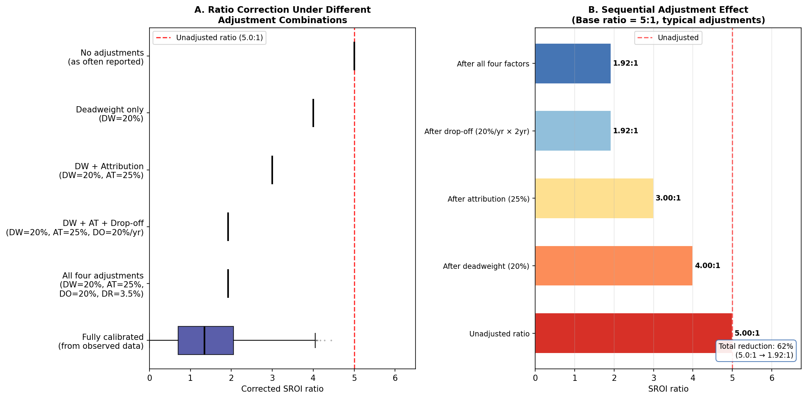
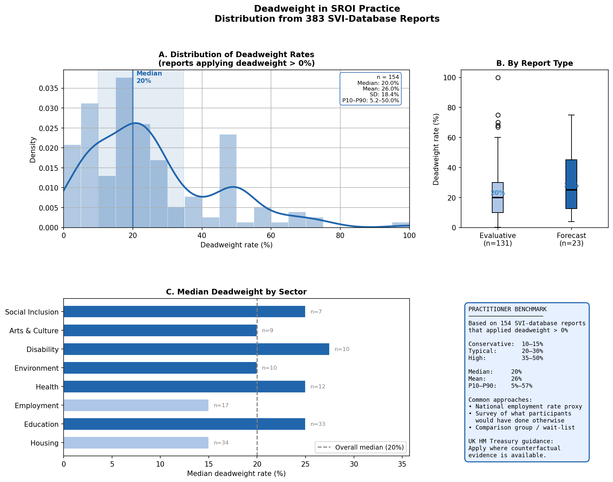
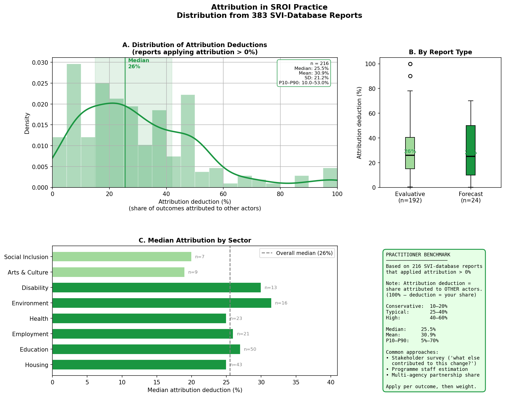
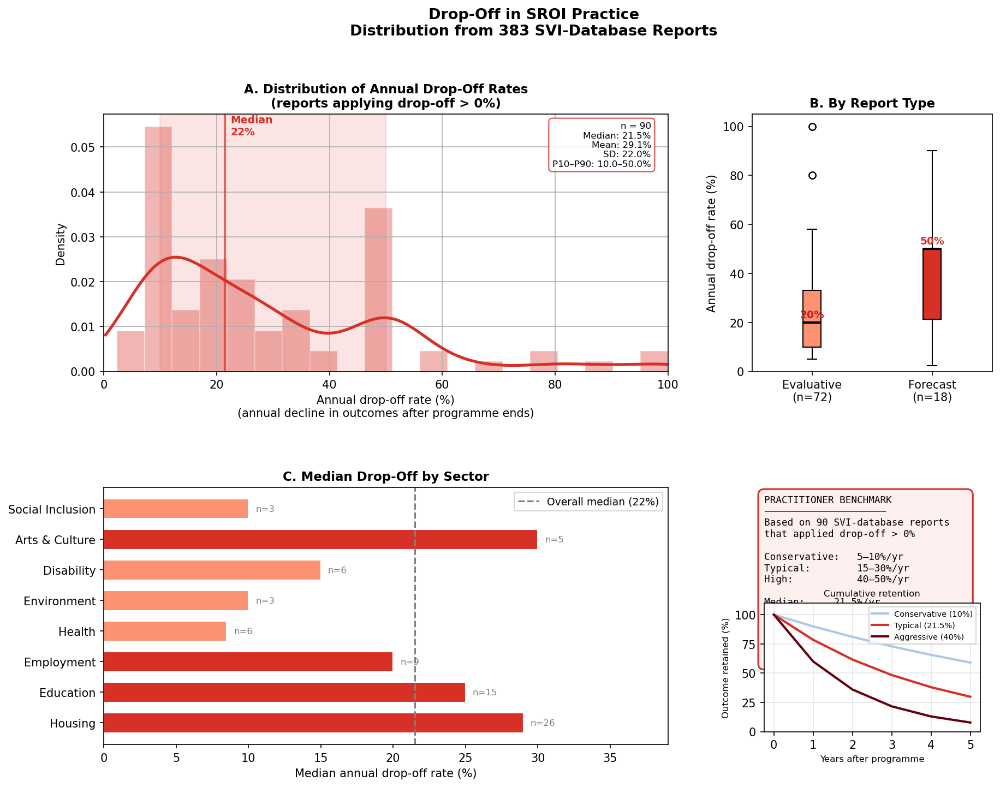
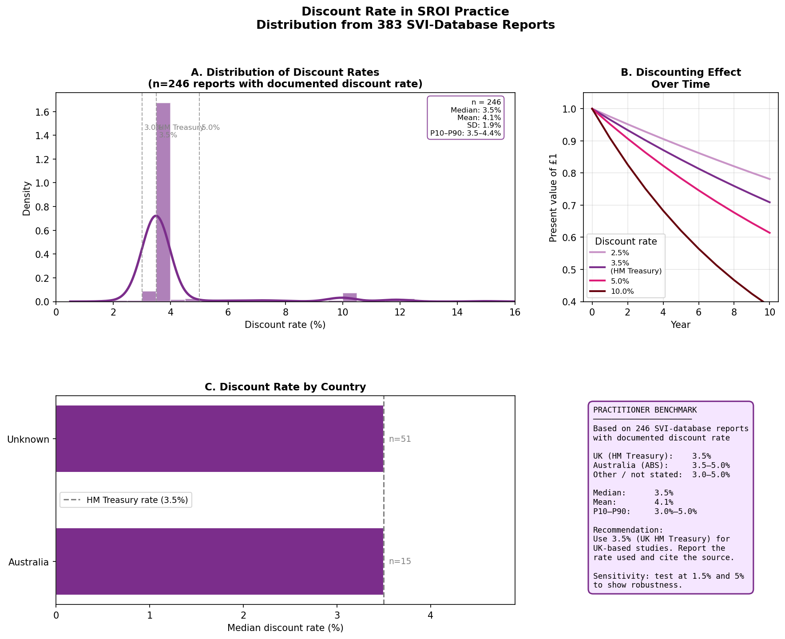
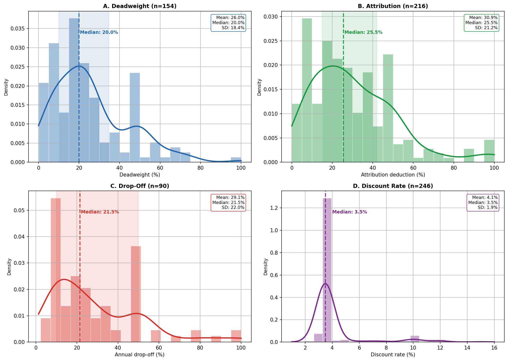

::: {.hero-banner}
# What value should I use?

This page answers the most practical question in SROI: *"I need to set a deadweight rate, an attribution correction, a drop-off rate, and a discount rate — what values do other practitioners use?"*

The benchmarks here are derived from **383 SROI reports** submitted to the Social Value International / Social Value UK database, spanning 2003–2024. This is the largest empirical analysis of SROI adjustment factor values ever conducted. Use these distributions as a starting point — then justify your specific value based on your programme's context.

::: {.meta}
Source: Full-PDF LLM extraction (GPT-4o + GPT-4o-mini) · N=383 reports · Sectors: housing, education, employment, health, arts, environment, and others · Countries: UK 53%, Australia 8%, USA 7%
:::
:::

## How to use this page

::: {.callout-important}
**These are empirical benchmarks, not prescriptions.** Use the distributions below as a reference for what other practitioners have applied. The SVI framework requires you to justify your adjustment values based on evidence specific to your programme, not to copy the median. A value that differs significantly from the benchmark is not wrong — it requires stronger justification.
:::

The four standard adjustment factors work sequentially to correct the raw social value estimate. The diagram below illustrates their combined effect on a base ratio of 5:1.



::: {.callout-note}
**Reading the diagram:** Each box represents the distribution of SROI ratios at that stage of correction. The dark horizontal line is the median. The box spans the 25th–75th percentile. The whiskers extend to the 10th and 90th percentile. The grey band shows how much the ratio changes when that adjustment is applied at its median value.
:::

---

## Deadweight

**What it is:** The proportion of the outcome that would have happened anyway, without the programme. A deadweight rate of 30% means that 30% of the observed change would have occurred even without the intervention.

**Formula:** Adjusted value = Raw value × (1 − deadweight rate)

**Evidence base:** 154 reports with documented deadweight values (40.2% of corpus)

::: {.columns}

::: {.column width="30%"}
### Summary statistics

| Statistic | Value |
|-----------|-------|
| **Median** | **20.0%** |
| Mean | 26.0% |
| Std. dev. | 18.4% |
| 10th percentile | 5.2% |
| 25th percentile | 10.0% |
| 75th percentile | 34.8% |
| 90th percentile | 50.0% |
| Range | 0.1% – 100% |
| N (with value) | 154 |

:::

::: {.column width="70%"}
### Distribution, by report type, and by sector


:::

:::

### When to set deadweight above or below the median

| Situation | Suggested direction | Reasoning |
|-----------|--------------------|-----------|
| **Universal programme** (open enrollment, no targeting) | Higher (30–50%) | Similar outcomes achievable without the programme; market saturation likely |
| **Highly targeted programme** (crisis intervention, specialist service) | Lower (5–15%) | Counterfactual is clearly "nothing" — few alternatives exist |
| **Employment programmes in tight labour markets** | Higher (25–40%) | Participants may have found employment anyway |
| **Employment programmes in high-unemployment areas** | Lower (10–25%) | Jobs are genuinely scarce |
| **Education supplementary programmes** | Medium (15–30%) | Some would have received support elsewhere |
| **Mental health / wellbeing services** | Lower (10–20%) | Specialist services with few alternatives |
| **Infrastructure / asset creation** | Lower (5–15%) | Physical assets have clear counterfactual of non-existence |

::: {.callout-tip}
**Primary evidence sources for deadweight:** (1) Local statistics on background rates of the outcome (e.g., national re-offending rates, local unemployment rates). (2) Waiting list data — if demand exceeds supply, deadweight is lower. (3) Comparable programme evaluations. (4) Primary data from stakeholders who describe whether the change would have happened without the programme.
:::

---

## Attribution

**What it is:** The share of the outcome attributable to other organisations or factors. A 30% attribution deduction means that 30% of the observed change is credited to other actors (partner organisations, family support, parallel programmes).

**Formula:** Adjusted value = Raw value × (1 − attribution deduction)

**Evidence base:** 216 reports with documented attribution values (56.4% of corpus)

::: {.columns}

::: {.column width="30%"}
### Summary statistics

| Statistic | Value |
|-----------|-------|
| **Median** | **25.5%** |
| Mean | 31.0% |
| Std. dev. | 21.2% |
| 10th percentile | 10.0% |
| 25th percentile | 15.0% |
| 75th percentile | 42.0% |
| 90th percentile | 53.0% |
| Range | 0.1% – 100% |
| N (with value) | 216 |

:::

::: {.column width="70%"}
### Distribution, by report type, and by sector


:::

:::

### Understanding attribution direction

::: {.callout-warning}
**Attribution notation ambiguity:** Some SROI reports state attribution as the share *claimed* by the programme ("we attribute 70% to this programme"), while others state the *deduction* ("30% attributed to other organisations"). This page uses the **deduction** convention — the proportion credited to others and therefore subtracted. If your source states "we attribute X% to our programme," your deduction is (100% − X%).
:::

### When to set attribution above or below the median

| Situation | Suggested direction | Reasoning |
|-----------|--------------------|-----------|
| **Sole provider** (no other comparable services in area) | Lower (10–20%) | Little contribution from other actors plausible |
| **Partnership programme** (multiple co-delivering organisations) | Higher (35–60%) | Multiple organisations co-created the outcome |
| **Wraparound services** (programme is one component of many) | Higher (30–50%) | Holistic outcomes result from multiple inputs |
| **Short, discrete intervention** | Lower (15–25%) | Limited time for other factors to accumulate |
| **Long-term relationship programme** | Higher (25–45%) | Other life factors inevitably contribute over time |
| **Criminal justice / re-offending** | Medium (20–35%) | Both programme and individual factors contribute |

::: {.callout-tip}
**Primary evidence sources for attribution:** (1) Direct question to beneficiaries: "What other factors contributed to this change?" (2) Partnership agreements that specify each organisation's role. (3) Consultation with other service providers in the area. (4) Review of parallel programme evaluations in similar contexts.
:::

---

## Drop-off

**What it is:** The annual rate at which outcomes decay over time. A drop-off of 20% per year means that in year 2 the outcome is 80% of year 1, in year 3 it is 64% (80% of 80%), and so on.

**Formula (year n):** Retained value = Value₁ × (1 − drop-off rate)^(n−1)

**Evidence base:** 90 reports with documented drop-off values (23.5% of corpus)

::: {.columns}

::: {.column width="30%"}
### Summary statistics

| Statistic | Value |
|-----------|-------|
| **Median** | **21.5%** |
| Mean | 29.1% |
| Std. dev. | 22.0% |
| 10th percentile | 10.0% |
| 25th percentile | 10.0% |
| 75th percentile | 50.0% |
| 90th percentile | 50.0% |
| Range | 2.3% – 100% |
| N (with value) | 90 |

:::

::: {.column width="70%"}
### Distribution, by report type, and by sector


:::

:::

### The bimodal pattern

The drop-off distribution is unusually bimodal — a cluster at 10% and another cluster at 50%. This pattern suggests that many practitioners choose from a limited range of conventional values rather than estimating outcome-specific decay rates. The SVI framework does not specify a default drop-off rate.

The 50% cluster likely reflects an implicit assumption that outcomes last approximately 2 years. The 10% cluster may reflect long-duration programmes (employment skills, health behaviour change) where practitioners assume outcomes are largely retained.

### Duration of outcomes and drop-off rates

| Outcome type | Typical duration | Implied drop-off range |
|-------------|-----------------|----------------------|
| **Skills acquisition** (vocational, literacy) | 3–5 years | 15–25% per year |
| **Behaviour change** (health, wellbeing) | 1–3 years | 25–50% per year |
| **Employment / income** | 2–4 years | 20–35% per year |
| **Physical asset** (housing improvement) | 10–20 years | 5–10% per year |
| **Social connection / relationships** | 1–2 years | 35–50% per year |
| **Education / qualifications** | 5–10 years | 10–15% per year |
| **Environmental outcomes** | 5–20 years | 5–15% per year |

::: {.callout-tip}
**Best practice for drop-off:** Specify the duration of the outcome (how many years the change persists) and the annual decay rate separately. This is clearer than a single drop-off number. Use stakeholder testimony and published outcome duration studies to justify duration. Do not count outcomes beyond the point where evidence of retention exists.
:::

---

## Discount Rate

**What it is:** The rate used to convert future social value into present value. A higher discount rate reduces the weight given to future outcomes. The rate reflects the cost of capital or the social rate of time preference — the premium society places on value received today versus value received in the future.

**Formula:** Present Value Factor = 1 / (1 + discount rate)^n

**Evidence base:** 246 reports with documented discount rates (64.2% of corpus)

::: {.columns}

::: {.column width="30%"}
### Summary statistics

| Statistic | Value |
|-----------|-------|
| **Median** | **3.5%** |
| Mean | 4.1% |
| Std. dev. | 1.9% |
| 10th percentile | 3.5% |
| 25th percentile | 3.5% |
| 75th percentile | 3.5% |
| 90th percentile | 4.4% |
| Range | 2.0% – 15.0% |
| N (with value) | 246 |

:::

::: {.column width="70%"}
### Distribution and discounting effect over time


:::

:::

### Standard reference rates by context

| Context | Rate | Source |
|---------|------|--------|
| **UK public sector** | 3.5% | HM Treasury Green Book (standard) |
| **UK social investment** | 3.5% | Aligned with HM Treasury |
| **Australia (DSS-funded programmes)** | 7.0% | Australian Government SROI guidelines |
| **European Union** | 3.0–5.5% | Varies by country; EC recommends 5% for major projects |
| **US federal** | 7.0% | OMB Circular A-94 |
| **Development programmes (low-income countries)** | 10.0–12.0% | World Bank country-specific rates |
| **Environmental / climate outcomes** | 1.4–2.0% | Ramsey rule / declining rates (long time horizons) |

::: {.callout-note}
**Why 3.5% dominates:** The UK HM Treasury Green Book specifies 3.5% as the social discount rate for public sector appraisals. Since most SVI-registered reports originate from the UK public and third sector, 3.5% is effectively the de facto standard. If your programme operates in a different national context, use your government's recommended rate. If no national rate exists, 3.5% is a defensible default for social programmes.
:::

::: {.callout-warning}
**Declining rates for long time horizons:** HM Treasury's Green Book recommends declining discount rates for very long-duration outcomes: 3.5% for years 0–30, 3.0% for years 31–75, 2.5% for years 76–125. This matters for environmental, housing, and infrastructure SROI work where outcomes persist for decades.
:::

---

## Combined Effect: The SROI Ratio Correction

The figures below show how applying all four adjustment factors together changes the SROI ratio distribution relative to unadjusted reports.



### The over-claiming calculation

Using the median values from this corpus:

| Step | Calculation | Remaining ratio |
|------|-------------|-----------------|
| Base SROI ratio | — | 5.00 |
| Apply deadweight (20%) | × (1 − 0.20) = × 0.80 | 4.00 |
| Apply attribution (25.5%) | × (1 − 0.255) = × 0.745 | 2.98 |
| Apply drop-off (21.5%, year 2) | × (1 − 0.215) = × 0.785 | 2.34 |
| Apply discount (3.5%, 3-year average) | × 1/(1.035)^1.5 ≈ × 0.950 | 2.22 |

Starting from a base ratio of 5:1, applying the median adjustment factors from this corpus reduces the ratio to approximately **2.2:1** — a 56% reduction. Reports that omit these adjustments overstate their social value by a factor of roughly 2.

::: {.callout-important}
**Practical implication:** If your SROI ratio exceeds 10:1 and you have not documented explicit deadweight, attribution, drop-off, and discount corrections, the ratio is likely to be substantially overstated. The SVI assurance standard specifically requires documentation of all four corrections before a report can receive the Assured status.
:::

---

## Sector-Specific Guidance

Based on the reports in this corpus, the table below summarises the typical ranges by sector for each adjustment factor. Use these as a rough guide when sector-specific benchmarks are needed.

Based on the empirical medians from this corpus (sectors with n≥3 reports applying each factor):

| Sector | Deadweight (empirical median) | n | Attribution (empirical median) | n |
|--------|-------------------------------|---|-------------------------------|---|
| **Housing** | 15% | 34 | 20% | 59 |
| **Education** | 25% | 33 | 25% | 50 |
| **Employment** | 15% | 17 | 25% | 36 |
| **Health / wellbeing** | 25% | 12 | 30% | 26 |
| **Environment** | 20% | 10 | 20% | 18 |
| **Disability** | 27.5% | 10 | 25% | 18 |
| **Arts & culture** | 20% | 9 | 30% | 13 |
| **Social inclusion** | 25% | 7 | 30% | 11 |

*n = number of reports in that sector that applied a non-zero value. Discount rate is 3.5% across all sectors (UK HM Treasury rate dominates). Drop-off data by sector is insufficient for reliable sector-level benchmarks (most sectors have n<5 applying non-zero values).*

---

## Frequently Asked Questions

::: {.callout-note collapse="true"}
## "I cannot find empirical data to justify my deadweight rate. What should I do?"

Document the search process and the reasons why local data is unavailable. Then use a benchmark from comparable programmes in the published SROI literature (such as this corpus). State clearly that the value is based on comparable programme benchmarks rather than programme-specific data, and include a sensitivity analysis showing how the ratio changes if the deadweight rate is 10 percentage points higher or lower.
:::

::: {.callout-note collapse="true"}
## "The SVI guide says I should ask stakeholders about attribution. What question should I use?"

A validated approach is to ask beneficiaries: *"Who or what else contributed to this change happening?"* followed by: *"What proportion of the change would you say was due to [programme name] versus other factors?"* The attribution deduction is then derived from these responses. This is more reliable than asking practitioners to estimate attribution in the abstract.
:::

::: {.callout-note collapse="true"}
## "Should I apply drop-off if my outcomes are ongoing?"

No. If an outcome is continuing at the same level in year 2 as year 1, the appropriate drop-off rate is 0%. Drop-off reflects decay, not continuation. However, if you claim ongoing outcomes without evidence of retention, you are likely over-counting. Build evidence of outcome durability into your follow-up data collection — even a simple one-year follow-up survey adds substantial credibility.
:::

::: {.callout-note collapse="true"}
## "My programme is in a country outside the UK. Which discount rate should I use?"

Use your national government's recommended social discount rate if one exists (e.g., Australia uses 7% for DSS-funded programmes). If no national rate is specified, 3.5% (UK HM Treasury Green Book) is widely accepted as an international default for social programmes, though rates of 5–7% are also defensible. State your justification and include a sensitivity test.
:::

::: {.callout-note collapse="true"}
## "My SROI ratio dropped dramatically when I applied adjustments. Is that a problem?"

No — it is the expected result. The median corrected ratio in this corpus (3.56:1) is substantially lower than the median unadjusted ratio. A ratio of 2–5:1 after full adjustment is common for well-evaluated social programmes. Communicating a lower but well-justified ratio is more credible to funders and commissioners than an inflated ratio with no adjustment documentation.
:::

::: {.callout-note collapse="true"}
## "Do I need to apply all four factors?"

The SVI Report Assurance Standard requires documentation of all four adjustment factors (or explicit justification for why each does not apply). In practice, as this study shows, only 5.2% of reports in the SVI database document all four. However, the Assured subsample (8 reports) shows dramatically higher compliance. If you are seeking Assured status, full adjustment documentation is effectively required.
:::

---

## Citation

If you use these benchmarks in an SROI report or academic publication, please cite:

> Muñoz, J.C. (2026). *From Principles to Practice: A Systematic Content Analysis of SROI Reporting in the Social Value International Database*. [Journal forthcoming]. Data and benchmarks available at: [this website URL].

```bibtex
@article{Munoz2026sroi,
  author  = {Juan Carlos Muñoz},
  title   = {From Principles to Practice: A Systematic Content Analysis of SROI
             Reporting in the Social Value International Database},
  year    = {2026},
  note    = {Forthcoming}
}
```

---

## Data Access

The full dataset underlying these benchmarks is available in the [Replication](replication.qmd) section. The benchmark JSON file (`factor_benchmarks.json`) contains all percentile values used in this page and can be downloaded directly for use in your own analysis.

```json
{
  "deadweight": {"median": 20.0, "p25": 10.0, "p75": 34.8, "n": 154},
  "attribution": {"median": 25.5, "p25": 15.0, "p75": 42.0, "n": 216},
  "drop_off":    {"median": 21.5, "p25": 10.0, "p75": 50.0, "n": 90},
  "discount_rate":{"median": 3.5, "p25": 3.5,  "p75": 3.5,  "n": 246}
}
```
