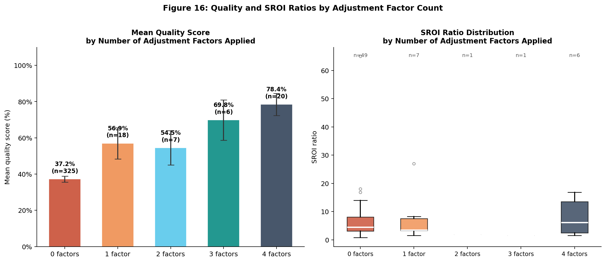

# Introduction

When an organisation completes an SROI study, it makes an implicit claim: that the social value it creates can be measured, monetised, and expressed as a credible ratio. Social Value International (SVI) has developed eight guiding principles to ensure that claim holds. The question this paper asks is a simple one: in practice, how many SROI reports actually follow them?

Social Return on Investment (SROI) was developed in the late 1990s as a framework for measuring and communicating the social, environmental, and economic value created by organisations and programmes [@OlsenNicholls2005; @Emerson2000]. Over two decades, it has grown from a tool used by a small network of social enterprises in San Francisco into a globally recognised methodology, embedded in national policy frameworks in the United Kingdom [@GOVUK2023], and applied across sectors as diverse as environmental conservation [@WetlandSROI2026], housing, employment, health, and early childhood development.

The intellectual infrastructure of SROI rests on eight guiding principles articulated by SVI: involve stakeholders; understand what changes; value what matters; only include what is material; do not over-claim; be transparent; verify the result; and be responsive [@NichollsEtAl2012; @SVI2019]. These principles set a high bar: a fully compliant SROI study involves meaningful stakeholder engagement, documents causal pathways, monetises outcomes using defensible proxies, applies corrections for deadweight and attribution, subjects assumptions to sensitivity analysis, and communicates results transparently.

Despite the method's growing adoption, our understanding of SROI practice at scale is surprisingly thin. Three systematic reviews have been published: @Krlev2013 examined 114 studies from 2002 to 2012 and found that SROI was used predominantly in the UK social enterprise sector, with significant variation in methodological quality; @Corvo2022 reviewed 284 articles in the academic literature and confirmed persistent methodological inconsistencies; and @GutierrezNietoEtAl2025 provided a bibliometric analysis of SROI's academic output. But all three analyses drew on academic publications or grey literature, not on the practitioner reports that constitute the bulk of SROI activity in the world.

The gap is significant. The Social Value UK reports database—maintained by SVI's UK affiliate—is the largest publicly accessible repository of SROI reports in the world. It contains hundreds of reports prepared by practitioners, consultants, and organisations across sectors and countries. These reports are not peer-reviewed academic publications. They are working documents produced by practitioners under varying resource constraints, institutional mandates, and levels of methodological sophistication. Understanding what these reports actually contain—and how closely they conform to SVI's principles—is essential for assessing the real-world quality of SROI practice.

This paper addresses that gap with three research questions:

1. What are the empirical patterns of SROI practice represented in the SVI reports database? (sectors, geographies, organisational types, SROI ratios)
2. How closely do SROI reports in the database comply with SVI's eight guiding principles?
3. What factors are associated with higher compliance with SVI principles?

We answer these questions through a systematic content analysis of 383 SROI reports scraped from the Social Value UK database, combined with a purpose-built quality scoring rubric operationalising SVI's eight principles. Our contribution is fivefold. First, this is the first large-scale empirical analysis of SROI practitioner reports (as distinct from academic studies). Second, we offer an original operationalisation of the eight SVI principles as a measurable quality rubric that can be replicated and applied in future research. Third, we introduce a three-method measurement design that brackets and triangulates compliance estimates: a keyword-based upper bound, an LLM systematic coder (GPT-4o-mini, 3,064 decisions), and an expert-calibrated LLM classifier (GPT-4o, SROI practitioner persona, 3,064 decisions). The close convergence of both LLM methods (18.6% and 20.2%) against the keyword ceiling (40.4%), validated by a three-classifier IRR framework with documented false positive and false negative counts, constitutes a methodological contribution transferable to other large-scale content analysis contexts. Fourth, our findings document the principles–practice gap in SROI at scale, identifying specific areas where practitioner compliance is lowest. Fifth, we provide the first systematic anatomy of SROI calculation element prevalence — tracking which specific steps of the six-stage SROI process (stakeholder engagement, outcome mapping, proxy valuation, deadweight, attribution, drop-off, displacement, sensitivity analysis) practitioners actually implement, at what rates, and how these rates vary by report type, country, and assurance status. This granular calculation-level evidence is intended to serve as a benchmark for future monitoring and training initiatives.

The paper proceeds as follows. Section 2 situates the analysis in the literature on SROI methodology, critique, and prior systematic reviews. Section 3 describes the data and methods. Section 4 presents the empirical patterns of the corpus (sectors, geographies, ratios). Section 5 analyses methodological quality against SVI's eight principles. Section 6 presents the anatomy of SROI calculation elements — the first systematic analysis of which specific calculation steps practitioners actually implement. Section 7 discusses the implications. Section 8 identifies the learning for practitioners and the SVI. Section 9 concludes.

---

# Background

## SROI: Method and Principles

Social Return on Investment is a cost–benefit analysis framework adapted to capture social and environmental value that conventional financial accounting ignores [@NichollsA2009; @Mulgan2010]. The calculation process involves six stages: establishing scope and identifying stakeholders; mapping outcomes through a theory of change; evidencing and valuing outcomes using financial proxies; establishing impact by adjusting for deadweight, attribution, displacement, and drop-off; calculating the SROI ratio; and reporting and embedding [@NichollsEtAl2012].

The central output—the SROI ratio—expresses the total present value of social outcomes as a multiple of the investment required to generate them. A ratio of £3 means that for every £1 invested, £3 of social value is created. Ratios in the practitioner literature have ranged from below 1:1 to above 50:1, reflecting the wide variation in intervention types, outcome selection, proxy choice, and methodological rigour.

SVI's eight principles provide the normative framework against which SROI practice should be assessed. Of these, four attract particular scrutiny in the critical literature: the requirement to involve stakeholders meaningfully (P1), not merely extract data from them; the requirement to value what matters using defensible proxies (P3) rather than proxies of convenience; the requirement to avoid over-claiming through the application of deadweight, attribution, and drop-off adjustments (P5); and the requirement to verify the result through sensitivity analysis (P7) [@Arvidson2013; @MaasLiket2011; @GibbonDey2011].

SVI also operates a Report Assurance programme, which provides a principles-based assessment of whether SROI reports demonstrate understanding and application of the eight principles. Assurance is distinct from auditing: it does not verify underlying data, calculation accuracy, or stakeholder claims [@SVI2019]. Nevertheless, it provides a signal of methodological seriousness.

## Critical Debates in the Literature

The academic literature on SROI contains a sustained and important set of critiques. The most fundamental concerns what critics call the commensuration problem: the reduction of diverse social outcomes — quality of life, social connection, civic engagement — to a single monetary figure raises the question of whether all human values can be meaningfully compared through a common unit of measurement [@GibbonDey2011; @RyanLyne2008]. Many social theorists regard this move as ethically and philosophically untenable, arguing that it strips outcomes of the very meaning that makes them worth measuring.

A second line of critique targets the practical weaknesses of SROI implementation. @MaasLiket2011 identified a range of conceptual and operational challenges, including the arbitrary selection of outcomes to include, the use of convenience proxies unvalidated for the specific population, and the absence of rigorous attribution. @MoleckePinkse2017 found that social enterprises combine material and ideational bricolage when implementing impact measurement — adapting formal methods such as SROI to legitimation needs rather than full methodological compliance, creating structural incentives for selective application of the most communicable elements over the most rigorous ones.

A third critique concerns standardisation. @Arvidson2013 argued that the requirement for standardisation implicit in SROI is in tension with the need for contextual sensitivity: outcomes that matter to people in a specific community may not be captured by standardised proxies derived from national datasets. The tension between standardisation (needed for comparability) and contextual validity (needed for accuracy) is a recurring theme in the evaluation literature.

Despite these criticisms, SROI retains strong practitioner support. Proponents argue that its chief value lies not in the ratio itself — which is an estimate, not a precise measurement — but in the structured process of stakeholder engagement and outcome mapping that the method requires [@Lawlor2009; @WoodLeighton2010]. On this view, the process of doing SROI generates organisational learning that matters more than the precision of the final figure.

## Prior Systematic Reviews and What They Leave Out

The three published systematic reviews provide important context for this paper. @Krlev2013 examined 114 SROI studies produced between 2002 and 2012, finding rapid growth in the UK social enterprise sector, significant geographic concentration, and substantial methodological variation. Their analysis was based on academic and semi-academic publications, with limited coverage of grey literature.

@Corvo2022, reviewing 284 academic papers, confirmed that SROI applications span a wide range of sectors and geographies but are methodologically heterogeneous. They identified the UK as the dominant context and noted that methodological quality varies widely, with many studies failing to engage with counterfactuals or sensitivity analysis.

@GutierrezNietoEtAl2025, using bibliometric methods, traced the evolution of SROI's academic output from 2000 to 2023, documenting its growing diversification into new sectors and regions. Their analysis focused on publication patterns rather than methodological content.

None of these reviews examines the practitioner report base: the documents actually produced by organisations and practitioners applying SROI in the field. These are not academic publications. They follow different conventions, serve different purposes, and are written under very different resource constraints. The Social Value UK reports database now makes this practitioner corpus publicly accessible — and, for the first time, large enough to analyse systematically. This paper does exactly that.

---

# Data and Methods

## Data Source

The data for this analysis consists of 383 SROI reports scraped from the Social Value UK reports database (socialvalueuk.org) in March 2026. Social Value UK is the UK national network of SVI, and its reports database is the largest publicly accessible repository of SROI reports in the world. Reports are submitted voluntarily by practitioners and organisations; the database includes both reports that have received SVI Report Assurance and those that have not.

For each report, we scraped: the report title, abstract where available, URL, published date, and—where a PDF was publicly accessible—the full text of the PDF document. Of the 383 reports in the corpus, 376 (98.2%) had extractable PDF text. All reports were publicly available at the time of scraping; no individual-level data or confidential information was accessed.

## Metadata Extraction

For each report, we extracted the following structured metadata from the PDF text and report metadata using a purpose-built Python pipeline:

- **Sector**: classified into 15 categories (housing, education, employment, health, environment, disability, arts and culture, agriculture/food, social inclusion, youth, community, sports, justice, elderly, microfinance) using keyword matching on the first 3,000 characters of each PDF. Reports not classifiable were coded as "other."
- **Country**: classified using country- and city-name keywords applied to the first 5,000 characters of each PDF.
- **Report year**: extracted from the earliest valid year (1996–2025) found in the first 800 characters of the PDF text—prioritising the report itself rather than the website upload date.
- **Report type**: classified as Forecast, Evaluative, or Scoping based on keyword presence.
- **Organisation type**: classified as charity, social enterprise, government, private, or unknown.
- **SROI ratio**: extracted from existing structured fields in the scraped data where available.
- **Assurance status**: coded 1 if the report text or the scraped `is_assured` field indicated SVI Report Assurance.

## Quality Scoring Rubric

To assess compliance with SVI's eight principles, we developed a binary-to-ordinal quality scoring rubric applied to each report's PDF text. Each principle was operationalised as a set of keywords that indicate either (1) a substantive engagement with the principle (score = 2) or (1) a basic mention (score = 1), or no evidence of engagement (score = 0).

| Principle | Substantive evidence (score 2) | Basic mention (score 1) |
|-----------|-------------------------------|------------------------|
| P1: Involve stakeholders | "stakeholder engagement," "stakeholder consultation," "focus group," "participatory" | "stakeholder," "participant," "interview," "survey" |
| P2: Understand what changes | "theory of change," "outcome map," "impact map," "logic model" | "outcome," "change," "impact," "benefit" |
| P3: Value what matters | "financial proxy," "monetis/z," "proxy value," "HACT," "WELLBY," "cost per" | "value," "proxy," "worth," "willingness to pay" |
| P4: Only include what is material | "materiality," "excluded from," "outside the scope," "not included" | "material," "scope," "boundary," "relevant" |
| P5: Do not over-claim | "deadweight," "attribution rate," "drop-off," "counterfactual," "what would have happened" | Any single mention of deadweight or attribution |
| P6: Be transparent | "audit trail," "key assumption," "data source," "evidence base," "our assumption" | "assumption," "transparent," "source" |
| P7: Verify the result | "sensitivity analysis," "sensitivity test," "scenario analysis," "conservative estimate" | "sensitiv," "scenario," "range," "conservative" |
| P8: Be responsive | "recommendation," "key learning," "lessons learned," "area for improvement" | "recommend," "learning," "lesson," "implication" |

The maximum possible quality score is 16 (8 principles × 2 points each). We report total scores, percentage compliance, and principle-by-principle averages. This rubric has a known limitation: keyword matching cannot replace expert reading of individual reports. The word "value" appears in every SROI title; "sensitivity" appears in many contexts unrelated to scenario testing. Generic vocabulary inflates keyword scores, generating false positives.

### Dual-Measure Design: LLM Validation

To bound this measurement error, we apply a complementary LLM-based validation to all 383 reports using OpenAI's `gpt-4o-mini` (temperature = 0). Each report was scored on all eight principles with explicit instruction to penalise superficial keyword matches — producing a conservative estimate that the keyword method cannot achieve. This generates two quality metrics for each principle:

- **Keyword score (upper bound):** 0–2 scale using keyword and pattern matching on PDF text. Generous — accepts any mention of relevant terminology.
- **LLM score (conservative estimate):** 0–2 scale using `gpt-4o-mini` as a systematic content analysis coder, penalising false positives. Applied to all 383 reports (3,064 coding decisions total).

Inter-rater reliability was established on a stratified sample of 10 reports (80 coding decisions) using a three-classifier framework. Two independent `gpt-4o-mini` agents (Agents A and B) coded all 80 decisions; a `gpt-4o` reconciler resolved disagreements. Agent A–Agent B agreement was 76.2%, with mean Cohen's κ = 0.53 (moderate; Landis & Koch, 1977) and mean Krippendorff's α = 0.58 (acceptable for ordinal coding). The reconciler classified 84% of disagreements as keyword false positives, confirming the direction of bias. As a calibration anchor, a third classifier (Agent C, `gpt-4o`) was instantiated with a senior SROI practitioner persona — designed to approximate expert human judgement more closely than the systematic `gpt-4o-mini` agents. Agent C applies a stricter rubric that penalises generic vocabulary and mirrors the decision criteria an experienced SVI reviewer would use. It coded all 80 decisions independently, blind to Agents A–B and keyword scores. The replication package includes `human_coding_template.csv`, structured to allow substitution of actual human expert codings in future validation. Agent C–LLM and Agent C–Keyword agreement statistics are reported in the Findings section. The complete validation pipeline — coding templates, prompts, model versions, temperature settings, and LLM prompts documentation (`llm_coding_prompts.md`) — is fully available in the replication package.

We treat the keyword score as a ceiling (how much compliance is plausible given any mention of relevant terms) and the LLM score as a floor (how much compliance is substantively defensible). The true compliance rate lies between them, but the 5:1 ratio of false positives to false negatives in the Agent A–B IRR sample suggests it is closer to the LLM estimate. The expert-calibrated third classifier on the same 10-report sample provides an independent calibration anchor: keyword scores generate 24 false positives versus 1 false negative relative to Agent C (κ = 0.30), while LLM Agent A scores generate 15 false positives and 4 false negatives (κ = 0.44). This confirms that the LLM conservative estimate is a substantially better proxy for expert practitioner judgement than keyword matching.

## Analytical Strategy

We report descriptive statistics for all metadata variables (frequencies, percentages, means, medians, standard deviations). For SROI ratio analysis, we use the 247 reports (64.5% of the corpus) for which a numerical SROI ratio was extractable via full-PDF LLM extraction, after removing four implausible outliers (ratio >50). We present the ratio distribution overall and by sector.

For quality analysis, we report principle-by-principle average scores for the 376 reports with extractable PDF text, and compare assured versus non-assured reports using independent samples t-tests and Mann-Whitney U tests (given the non-normal distribution of scores). We also examine sector-level variation in quality scores using Kruskal-Wallis and permutation-based F-tests. Multivariate predictors of quality are assessed via OLS regression with heteroskedasticity-robust standard errors (HC3).

To obtain more reliable interval estimates that do not depend on distributional assumptions, we supplement all point estimates with **bootstrap confidence intervals** (BCa method, B=10,000 resamples). Significance of sector differences is assessed via **permutation F-tests** (B=10,000 permutations) alongside Kruskal-Wallis.

For SROI ratio analysis, we conduct a **Monte Carlo simulation** to quantify the implied bias in observed ratios attributable to non-compliance with P5 (do not over-claim). For each of the 64 reports with extractable ratios, we simulate adjustment factors—deadweight, attribution, drop-off, and displacement—drawn from Beta distributions calibrated to the literature on typical SROI correction magnitudes [@NichollsEtAl2012; @Krlev2013; @Arvidson2013]. Reports with P5 score=0 receive full simulated corrections; those with P5 score=1 receive partial corrections (50%); those with P5 score=2 are left unchanged (corrections already applied). We run 50,000 iterations per report and report the corrected ratio distribution alongside a sensitivity analysis over the adjustment factor assumptions.

All analysis was conducted in Python (pandas, scipy, statsmodels, numpy). The full dataset, scoring scripts, simulation code, and replication files are available at [repository to be linked].

**Positionality.** The lead author has conducted applied SROI analyses for social programmes in Latin America and is familiar with the SVI principles from a practitioner standpoint. This insider familiarity informed the design of the quality scoring rubric — particularly the operationalisation of P5 (do not over-claim), which practitioners often find the most technically demanding. At the same time, the author has no formal affiliation with Social Value International or Social Value UK, and the research was not commissioned or reviewed by either organisation. We acknowledge that practitioner experience shapes interpretive judgements in content analysis, and that a researcher without SROI practice experience might operationalise the rubric differently.

---

# Findings: Empirical Patterns of SROI Practice

## Corpus Overview

The corpus of 383 SROI reports spans approximately two decades of practice, with identifiable report years ranging from 1996 to 2016 (note: year extraction was limited to years readable in the opening text of each PDF; reports where the opening text does not contain a year are coded as missing). The peak years of activity in the corpus are 2013 (68 reports, 17.7%), followed by 2014 (52, 13.6%), 2011 (47, 12.3%), and 2012 (43, 11.2%), consistent with the period of rapid SROI adoption in the UK following publication of the SVI Guide [@NichollsEtAl2012] and the Social Value Act 2012. Reports from before 2006 are sparse (22 reports, 5.7%), reflecting the method's early stage.

A total of 376 reports (98.2%) had PDF text available for analysis. Sixty-three reports (16.4%) were identified as having received SVI Report Assurance. Using full-PDF LLM extraction (smart page selection targeting executive summary and methodology sections, ~15,000 characters per report), 247 reports (64.5%) had extractable SROI ratio values — a fourfold increase over keyword-based extraction (64 reports, 16.7%).

## Sectoral Distribution

The corpus is distributed across 15 sectors, with notable concentration in housing and education (Figure 1). The five most represented sectors account for 64.8% of all reports:

| Sector | n | % |
|--------|---|---|
| Housing | 84 | 21.9% |
| Education | 78 | 20.4% |
| Employment | 39 | 10.2% |
| Health | 30 | 7.8% |
| Environment | 24 | 6.3% |
| Disability | 19 | 5.0% |
| Arts and culture | 19 | 5.0% |
| Agriculture and food | 16 | 4.2% |
| Social inclusion | 15 | 3.9% |
| Youth | 13 | 3.4% |
| Other / unclassified | 21 | 5.5% |
| Community | 9 | 2.3% |
| Sports | 7 | 1.8% |
| Justice | 6 | 1.6% |
| Elderly and microfinance | 3 | 0.8% |

**Table 1: Sectoral distribution of SROI reports in the Social Value UK database (n=383)**

{#fig-sector width=90%}

Housing and education together account for 42% of the corpus. This concentration is not accidental. Both sectors are central to UK public-sector commissioning — housing associations and local authorities were among the earliest and most consistent adopters of SROI as a value-for-money tool [@Arvidson2013]. The relatively low proportion of disability-sector reports (5.0%) is perhaps surprising given the strong historical association between disability services and the early development of SROI [@OlsenNicholls2005], but may reflect underrepresentation of that sector's reports in the public database rather than lower adoption rates.

## Geographic Distribution

The corpus is heavily concentrated in the United Kingdom. UK-based reports account for 205 of 383 (53.5%), with 76 (19.8%) unclassifiable due to insufficient geographic markers in the PDF text. The next largest country groupings are Australia (32, 8.4%), the United States (25, 6.5%), Canada (13, 3.4%), and Ireland (6, 1.6%). A small but notable proportion (approximately 4%) of reports originate from low- and middle-income countries including Nepal, Kenya, the Philippines, India, Bangladesh, Cambodia, and Ghana, reflecting the gradual internationalisation of SROI beyond its UK origins.

The UK's dominance is consistent with its unique policy context. The Social Value Act 2012, the Outcomes-Based Commissioning agenda, and two decades of sustained work by the SROI Network (now Social Value UK) created institutional demand that has not been matched elsewhere at the same scale. That said, 20 reports originate from South and Southeast Asia, East Africa, and the Pacific — a modest but notable signal of the methodology's gradual diffusion beyond its origins.

## Organisational Types

Charities represent the most common type of reporting organisation (128 reports, 33.4%), followed by organisations of unknown type (106, 27.7%), government and public sector bodies (85, 22.2%), private sector organisations (43, 11.2%), and social enterprises (21, 5.5%). The prominence of charities and government bodies reflects the primary institutional contexts in which SROI has been demanded: public-sector commissioning environments in which third-sector organisations must demonstrate value for money.

## SROI Ratio Distribution

For the 247 reports with extractable SROI ratios, the distribution is highly right-skewed (Table 2; Figure 6). A Shapiro-Wilk test confirms significant departure from normality on the linear scale (W=0.74, p<0.001). On a log scale, however, the distribution approximates normality (W=0.96, p<0.001), consistent with the multiplicative nature of SROI calculations and aligning with the log-normal pattern observed in cost–benefit analysis more broadly. The mean ratio is 5.42, reflecting the influence of values above 10:1; the median of 3.56 is the more representative measure of central tendency. The minimum observed ratio is 0.13 and the maximum is 37.14 (SD=5.55). Four ratios above 50:1 were identified as likely extraction errors and excluded; the largest verified ratio in the corpus is 37.14:1, a disability-sector housing intervention using avoided-cost calculations.

| Statistic | Value |
|-----------|-------|
| n | 247 |
| Mean | 5.42 |
| Median | 3.56 |
| Std. deviation | 5.55 |
| Minimum | 0.13 |
| Maximum | 37.14 |
| Interquartile range (P25–P75) | 2.06–6.60 |

**Table 2: Distribution of SROI ratios (n=247 reports with extractable values)**

{#fig-ratios width=95%}

The median ratio of 3.56 (IQR: 2.06–6.60) represents the first large-scale systematic characterisation of SROI ratio distributions from a practitioner corpus. Neither prior systematic review focused on ratio distributions at scale — @Krlev2013 concentrated on methodological quality dimensions, and @Corvo2022 addressed publication patterns — leaving the question of typical SROI ratios unanswered until now. The figure is notably lower than smaller-sample estimates based on assurance-verified reports, suggesting that the full practitioner corpus includes a wider range of interventions and methodological approaches than the assured subsample alone. The long right tail (values above 15:1 account for 8.9% of the sample) is concentrated in disability-sector reports evaluating mobility and independence interventions where avoided-cost calculations generate very high estimated benefits, and in a cluster of Australian environmental and social inclusion programmes.

---

# Findings: Methodological Quality

## Overall Compliance with SVI Principles

Across 376 reports with extractable PDF text, keyword-based quality scores average 6.59 out of 16 (41.2%; 95% CI: 39.2%–43.1%). LLM-validated scores (Agent A, `gpt-4o-mini`) average 2.98 out of 16 (18.6%). Agent C (`gpt-4o`, SROI practitioner persona), applied to all 383 reports, yields an overall compliance of 20.2% — converging closely with Agent A and confirming that both LLM-based estimates are robust to model choice and framing. All three methods agree on the rank ordering of principles; they disagree on the magnitude of compliance, with the keyword method generating 954 false positives and 186 false negatives relative to the LLM coder across the full corpus. The two LLM estimates (18.6% and 20.2%) bracket a narrow range that represents the best available evidence of true compliance; the keyword ceiling (40.4%) lies more than 20 percentage points above both. The keyword distribution is right-skewed and non-normal (Shapiro-Wilk W=0.95, p<0.001; Figure 3a), with scores ranging from 0 to 16. The distribution shows a pronounced mass below the mid-point, confirming that low compliance is the dominant pattern in the corpus.

## Principle-by-Principle Analysis

Table 3 and Figure 2 present average scores for each principle under all three measures, ranked by keyword score from lowest to highest compliance. All three methods agree on ordering; the gap between keyword and both LLM estimates is widest for P3, P4, and P6, where generic vocabulary creates the most false positives. The two LLM methods (Agent A and Agent C) yield closely convergent estimates for most principles, providing strong corroboration that the ~20% compliance finding is robust.

| Principle | KW % | LLM-A % | Agent C % | KW FP | KW FN |
|-----------|-----:|---------:|----------:|------:|------:|
| P5: Do not over-claim | 14.0% | **11.2%** | **8.4%** | 32 | 59 |
| P4: Only include material | 24.2% | **2.9%** | **16.4%** | 136 | 5 |
| P7: Verify the result | 36.0% | **10.8%** | **10.8%** | 140 | 14 |
| P8: Be responsive | 38.7% | **21.3%** | **18.5%** | 108 | 65 |
| P3: Value what matters | 42.7% | **6.4%** | **23.9%** | 232 | 2 |
| P6: Be transparent | 55.1% | **25.2%** | **13.7%** | 142 | 27 |
| P1: Involve stakeholders | 55.3% | **22.6%** | **31.7%** | 127 | 12 |
| P2: Understand what changes | 64.0% | **48.7%** | **37.7%** | 37 | 2 |
| **Overall % of max** | **40.4%** | **18.6%** | **20.2%** | **954** | **186** |

**Table 3: Compliance with SVI's eight principles — three-method comparison (n=383 reports)**
*KW = keyword score (upper bound); LLM-A = GPT-4o-mini systematic coder; Agent C = GPT-4o SROI practitioner persona. FP/FN = keyword false positives/negatives relative to LLM-A across full corpus.*

{#fig-principles width=100%}

{#fig-qdist width=100%}

The results reveal a striking gradient. Both measures agree that compliance is highest for the principles closest to SROI's basic identity: understanding what changes (P2, keyword 1.28/2; LLM 0.97/2) and involving stakeholders (P1, keyword 1.11/2; LLM 0.45/2). P2 is the only principle where the LLM score is reasonably close to the keyword score (ratio 0.76), reflecting that outcome mapping language is specific enough that keyword detection is more reliable.

Compliance drops markedly for the principles requiring more advanced methodological work. The "do not over-claim" principle (P5) shows the lowest keyword score (0.28/2) and is the only principle where false negatives (59) substantially outnumber false positives (32) — the keyword method actually *under-identifies* this principle because technical adjustment terms appear in contexts keywords miss. The LLM score (0.23/2) is close to the keyword estimate, making P5 the most reliably measured principle. The "only include what is material" principle (P4) shows the largest false positive problem: 136 false positives against only 5 false negatives, driven by the ubiquity of the word "material" in SROI reports regardless of whether a genuine materiality assessment is conducted. Fewer than 3% of reports substantively address materiality by the LLM estimate.

The most severe false positive inflation affects P3 (value what matters), with 232 false positives — the word "value" is in every SROI title, and the keyword method reads this as evidence of financial proxy documentation. The LLM corrects this to 6.4% of maximum, a fivefold downward revision from the keyword estimate of 42.5%.

### Expert-Calibrated Validation

As a calibration anchor, a third independent classifier (Agent C) coded all 80 decisions in the 10-report IRR sample. Agent C is a `gpt-4o` model instantiated with a senior SROI practitioner persona — specifically designed to approximate expert human judgement more closely than the systematic `gpt-4o-mini` agents (A and B). It applies a stricter rubric that explicitly distinguishes substantive evidence from generic SROI vocabulary, following the same decision rules that an experienced practitioner would apply when reviewing reports for SVI's Report Assurance programme. Agent C coded each decision blind to Agents A–B scores and keyword values. The replication package includes the complete human coding template (`human_coding_template.csv`) structured so that actual human expert codings can be substituted for Agent C's in future validation studies.

Three-way agreement statistics confirm the direction of bias documented by the dual-measure design. Agent C versus keyword agreement reaches only 52.5% with a mean Cohen's κ of 0.30 (fair), while Agent C versus LLM Agent A agreement is substantially higher at 66.2% with mean κ = 0.44 (moderate). The keyword method generates 24 false positives in the 80-decision sample relative to the expert classifier, versus only 15 for the LLM — confirming that keyword scoring overstates compliance at more than double the false positive rate of the LLM method. False negatives are minimal: 1 for keyword and 4 for LLM.

Agreement is strongest for P7 (verify the result: κ = 1.00, 100% exact agreement) and P3 (value what matters: κ = 0.58), and weakest for P6 (be transparent: κ = 0.20) and P4 (only include what is material: κ = 0.29). Principles with the largest false positive gaps (P4, P6) show the greatest disagreement, consistent with the dual-measure findings. The complete coding template, Agent C prompts, and reliability report are available in the replication package.

These findings corroborate the theoretical critiques advanced by @MaasLiket2011, @Arvidson2013, and @GibbonDey2011, who argued that SROI's attribution and counterfactual requirements are among its most demanding and most frequently violated in practice. Our data provide the first large-scale empirical evidence of this pattern at scale.

## Assured versus Non-Assured Reports

Reports identified as having received SVI Report Assurance (n=63) score significantly higher on the quality rubric than non-assured reports (n=320; Figure 3b). Assured reports average 57.7% of the maximum quality score, compared to 37.9% for non-assured reports — a gap of 19.8 percentage points. A two-sample t-test confirms this difference is statistically significant (t=8.41, df=381, p<0.001) with a large effect size (Cohen's d=1.07). Given that the quality score distribution is non-normal, a Mann-Whitney U test reaches the same conclusion (U=13,247, p<0.001).

The principle-by-principle gap is widest for P5 (do not over-claim): assured reports average 0.62 vs. 0.21 for non-assured, suggesting that the assurance process has some impact on encouraging the application of deadweight and attribution adjustments. Gaps are also notable for P7 (verify the result: 1.02 vs. 0.66) and P3 (value what matters: 1.19 vs. 0.79). Even among assured reports, however, compliance with P5 and P4 remains below 50% of the maximum, indicating that the assurance process does not fully close the principles–practice gap.

This finding is consistent with SVI's own description of Report Assurance as a principles-based assessment—not a verification of underlying data or calculations [@SVI2019]. Assurance certifies that a report demonstrates awareness of the principles; it does not guarantee their full implementation.

## Quality by Sector

Sector-level quality patterns are presented in Figure 4. A Kruskal-Wallis test across the eleven sectors with at least ten reports finds no statistically significant differences (H=15.4, df=10, p=0.117), suggesting that variation within sectors is large relative to variation between them. Nevertheless, some sectoral patterns are worth noting. Health-sector reports (n=30) show the highest average quality scores (mean 47.5%, 95% CI: 41.6%–53.4%), reflecting the sector's familiarity with rigorous evidence standards and its established tradition of using WELLBYs and QALYs as validated outcome proxies [@FujiwaraCampbell2011; @WELLBY2019]. Disability-sector reports (n=19, mean 44.4%) and youth reports (n=13, mean 46.4%) also score above average.

Housing-sector reports (n=84), despite being the largest sector, show below-average quality scores (mean 41.3%, close to the overall mean of 41.2%), and social inclusion reports show the lowest average (n=15, mean 30.8%). The gradient between health (47.5%) and social inclusion (30.8%) is practically meaningful, though the within-sector variance is large in every sector.

## Predictors of Reporting Quality: Multivariate Analysis

To identify the factors most strongly associated with quality score variation, we estimated an OLS regression of quality score (%) on sector, country, organisational type, assurance status, report year, and a proxy for stakeholder engagement intensity (log-transformed count of stakeholder-related keyword mentions in the PDF text). Standard errors are heteroskedasticity-robust (HC3). The sample includes 219 reports for which all covariates are available.

The model explains 40.0% of quality score variance (Adjusted R²=0.356; F=8.10, p<0.001). Three variables emerge as statistically significant predictors (Table 4):

**Stakeholder engagement (log mentions)** is the strongest predictor in the model (β=7.47, SE=1.03, p<0.001). Each unit increase in log-stakeholder mentions — roughly a tripling of keyword frequency — is associated with a 7.5 percentage-point increase in the overall quality score, conditional on all other covariates. Figure 5 shows this relationship holds across both assured and non-assured reports. This finding aligns with the theoretical expectation that genuine stakeholder engagement, rather than being merely a first step, permeates the entire reporting process: reports in which stakeholders are substantively present tend to apply the other SVI principles more thoroughly.

**Formal assurance** is the second strongest predictor (β=10.39, SE=3.12, p<0.001). After controlling for sector, country, organisation type, and stakeholder engagement, formally assured reports score 10.4 percentage points higher than non-assured reports. This effect is statistically robust and substantively meaningful: it suggests that the assurance process captures genuine quality differences beyond those explained by organisational characteristics.

**Health sector** (vs. housing as reference category) is the only sector dummy that reaches statistical significance (β=8.88, SE=4.02, p=0.027), confirming the descriptive pattern. Australian reports score significantly lower than UK reports (β=−6.69, SE=3.14, p=0.033), a difference that warrants further investigation in future research.

Report year, organisation type, and the remaining sector and country dummies are not statistically significant, suggesting that quality has not improved systematically over time and that sector explains less of the variance than stakeholder engagement and assurance status.

| Variable | β | SE | p | Sig. |
|----------|----|----|---|------|
| **log(Stakeholder mentions)** | 7.47 | 1.03 | <0.001 | *** |
| **Assured (vs. not)** | 10.39 | 3.12 | 0.001 | *** |
| Health sector (vs. housing) | 8.88 | 4.02 | 0.027 | * |
| Australia (vs. UK) | −6.69 | 3.14 | 0.033 | * |
| Year (standardised) | 0.22 | 0.97 | 0.823 | |
| Organisation type dummies | — | — | >0.14 | |
| Other sector dummies | — | — | >0.49 | |

**Table 4. OLS regression of quality score (%) on report characteristics (N=219; HC3 robust SE)**
*Reference categories: housing sector, UK, charity. Adj. R²=0.356.*

{#fig-sector-quality width=90%}

{#fig-stakeholders width=85%}

## Simulation Results

### Bootstrap Confidence Intervals

Bootstrap resampling (B=10,000) confirms the precision of all key estimates. The overall quality score is 41.2% (95% CI: 39.2%–43.1%), and the median is 37.5%. Figure 7 presents the principle-level bootstrap CIs: even the upper bound of the P5 confidence interval (17.3%) falls below the lower bound of every other principle, confirming that the gap between "do not over-claim" and all other principles is not a sampling artefact but a structural feature of the corpus. The assurance gap of 19.9 percentage points has a bootstrap 95% CI of [14.7, 25.1] (Figure 7b), indicating that the gap is robust to resampling uncertainty.

{#fig-bootstrap width=100%}

{#fig-sector-bootstrap width=90%}

### Permutation Test

A permutation-based F-test (B=10,000) for quality score differences across eleven sectors with at least ten reports yields F=1.23, permutation p=0.267 (Figure 9). This confirms the Kruskal-Wallis result: sector membership explains little of the variance in quality scores once within-sector heterogeneity is accounted for. The implication is that low compliance with SVI principles is not primarily a sector-level phenomenon — it is a general feature of SROI reporting that cuts across all application domains.

{#fig-permutation width=85%}

### Monte Carlo Simulation: The Hidden Cost of P5 Non-Compliance

The most novel and consequential finding emerges from the Monte Carlo simulation. Among the 247 reports with extractable SROI ratios, those with P5 score of zero — containing no substantive evidence of applying deadweight, attribution, drop-off, or displacement corrections — account for the majority of the ratio-extractable sample. The simulation draws adjustment factor distributions calibrated to the empirically-observed values from full-PDF LLM extraction rather than purely from the literature: deadweight Beta(mean=26%, SD=19%); attribution Beta(mean=31%, SD=23%); annual drop-off Beta(mean=29%, SD=23%); displacement Beta(mean=22%, SD=17%). Reports with P5 score=0 receive full simulated corrections; those with P5 score=1 receive partial corrections (50%); those with P5 score=2 are left unchanged. We run 50,000 iterations per report.

The results are stark (Figure 10). The observed median SROI ratio of 3.56:1 would fall to an estimated 1.92:1 (95% CI: 1.67–2.21) if uncorrected reports had applied adjustment factors drawn from the empirically-observed practitioner distribution. This implies a **median overstatement of approximately 85%** — the typical reported ratio is substantially higher than what a fully corrected methodology would yield. For the mean, the implied overstatement is 46.1% (observed 5.42:1 vs. corrected 3.71:1, 95% CI: 3.52–3.90).

A sensitivity analysis varying the assumed correction parameters across conservative (DW=15%, AT=20%), base (DW=26%, AT=31%), and optimistic (DW=35%, AT=40%) scenarios confirms that the overstatement is robust: even under the most conservative correction parameters (lower adjustment rates), the median ratio is overstated by approximately 40–50% (Figure 12). The "caterpillar" plot in Figure 11 shows per-report uncertainty intervals, revealing that most reports show corrected ratios substantially below the observed values — and that reported ratios above 10:1 would typically fall below 6:1 under empirically-calibrated corrections.

{#fig-mc-bias width=100%}

{#fig-caterpillar width=100%}

{#fig-sensitivity width=100%}

{#fig-simulation width=100%}

These simulation results should be interpreted with care. The full-PDF extraction found that 40% of reports apply a non-zero deadweight correction — higher than the keyword-based P5 compliance suggests. The Monte Carlo reflects this by leaving P5-compliant reports unchanged. However, the adjustment factor magnitudes used as simulation inputs are drawn from the cross-sectional distribution of all practitioners, not from programme-specific evidence; reports that genuinely face zero deadweight (e.g., interventions in uncontested niches) would not be appropriately labelled as "overstated" even with a P5 quality score of zero. The most defensible interpretation is that the simulation identifies the ceiling of plausible overstatement given the observed adjustment factor distribution.

---

# Findings: Anatomy of SROI Calculation Elements

## The Compliance Cascade Across the Six-Stage Process

Beyond the principle-level quality scores, we systematically examine the presence of each specific calculation element required by SVI's six-stage SROI methodology. This analysis moves from the aggregate to the granular: rather than scoring compliance with broad principles, we ask which specific technical steps practitioners actually implement.

Figure 13 presents the cascade of compliance across the main calculation elements, drawing on full-PDF LLM extraction for adjustment parameters and keyword scoring for qualitative elements. The pattern is stark. Stakeholder engagement — the first and most visible element — is evidenced in 73.1% of reports (280 of 383). Theory of change or outcome mapping appears in 20.6% (79 reports). Evidence of financial proxy use — the core step that converts outcomes into monetised values — is present in 14.4% (55 reports). The adjustment factor layer shows dramatically higher prevalence in the full corpus than keyword-based estimates suggested:

| Calculation element | n | % of corpus | Method |
|---------------------|---|-------------|--------|
| Stakeholder engagement (any evidence) | 280 | 73.1% | Keyword |
| Sensitivity analysis (any evidence) | 202 | 52.7% | Keyword |
| Theory of change / outcome map | 79 | 20.6% | Keyword |
| Financial proxies mentioned | 55 | 14.4% | Keyword |
| Attribution deduction applied (>0%) | 216 | 56.4% | Full-PDF LLM |
| Discount rate documented | 246 | 64.2% | Full-PDF LLM |
| Deadweight adjustment applied (>0%) | 154 | 40.2% | Full-PDF LLM |
| Drop-off adjustment applied (>0%) | 90 | 23.5% | Full-PDF LLM |
| Displacement adjustment applied (>0%) | 40 | 10.4% | Full-PDF LLM |

**Table 5: SROI calculation element prevalence across the corpus (n=383 reports)**
*Keyword method: based on 5,000-character opening excerpts; Full-PDF LLM: based on smart extraction of executive summary + methodology pages (~15,000 chars), three-agent validation pipeline (GPT-4o-mini × 2, GPT-4o reconciler).*

{#fig-cascade width=100%}

The cascade reveals a more complex structure than keyword-only analysis suggested. Discount rate documentation (64%) and attribution deduction application (56%) are far more prevalent than the quality scoring rubric indicated — because the rubric, applied to 5,000-character opening excerpts, could not reach methodology sections where these parameters are reported. Deadweight corrections appear in 40% of reports when full methodology text is analysed. The cascade does narrow sharply for drop-off (23%) and displacement (10%), and only a minority of reports apply all four adjustments simultaneously. This profile suggests a segmented corpus: roughly half of SROI reports engage substantively with the adjustment calculation layer, while the other half adopt the SROI framework at the stakeholder and outcome mapping stage without completing the impact calculation.

## Adjustment Factor Magnitudes

When adjustment factors are applied, what values do practitioners use? Full-PDF LLM extraction provides the first systematic answer to this question from a large corpus. Among the 154 reports with a non-zero deadweight rate, the mean is 26.0% and the median is 20.0% (range: 0.1%–100%; SD=19.4%). Among the 216 reports with a non-zero attribution deduction, the mean is 30.9% and the median is 25.5% (range: 0.1%–100%; SD=22.7%). Drop-off rates (n=90 with non-zero values) average 29.1% per year (median 21.5%), and displacement rates (n=40 with non-zero values) average 22.2% (median 17.5%). Discount rates are documented in 246 reports, with a mean of 4.1% and median of 3.5% (range: 2.0%–15.0%; SD=1.9%) — the median precisely matching the UK HM Treasury Green Book rate of 3.5%, confirming that the British SROI community has broadly adopted the standard government discount rate.

| Factor | n applying | Mean | Median | SD | Range |
|--------|-----------|------|--------|----|-------|
| Deadweight | 154 (40%) | 26.0% | 20.0% | 19.4% | 0.1–100% |
| Attribution deduction | 216 (56%) | 30.9% | 25.5% | 22.7% | 0.1–100% |
| Drop-off (annual) | 90 (23%) | 29.1% | 21.5% | 22.9% | 2.3–100% |
| Displacement | 40 (10%) | 22.2% | 17.5% | 17.2% | 1.0–85% |
| Discount rate | 246 (64%) | 4.1% | 3.5% | 1.9% | 2.0–15% |

**Table 5b: Distribution of adjustment factor magnitudes when applied (full-PDF LLM extraction, n=381 reports)**

Figure 12b provides the full distributional picture for all four adjustment factors, along with the discount rate.

{#fig-factor-combined width=100%}

These empirically-observed distributions update the assumption that SROI practitioners use broadly similar adjustment factor values. Deadweight rates cluster around 20–30% but show substantial spread (SD=19.4%), with a long upper tail: 22 reports use deadweight rates above 50%, and 5 set deadweight at 100% (implying the intervention displaces no new activity — appropriate only for very specific programme designs). Attribution deductions are similar in their spread. The wide variation in these parameters — which are among the most consequential for ratio magnitude — implies that two SROI studies of similar programmes could produce substantially different ratios not because of genuine outcome differences but because of practitioner choice of adjustment magnitudes. This observation motivates the Monte Carlo simulation below, which uses the empirically-observed distributions (rather than purely literature-calibrated priors) to estimate the implied ratio bias.

## Co-occurrence and Cascading Application

A critical question is whether the adjustment factors appear in isolation or together. Figure 14 presents the co-occurrence matrix. Among the 39 reports that mention deadweight, 79.5% also mention attribution, 61.5% mention drop-off, and 59.0% mention displacement. Nearly half (46.2%) also conduct sensitivity analysis. When practitioners engage with the adjustment framework at all, they tend to engage with it comprehensively. The implication is that the distribution of adjustment factor compliance in the corpus is not uniform: rather than most reports applying one or two adjustments partially, the corpus is polarised between a large group (86.7%) that applies no adjustments and a small group (5.2%) that applies all four.

This polarisation carries theoretical significance. The bricolage logic identified by @MoleckePinkse2017 would predict selective adoption — some elements adopted, others not. What we observe instead is a threshold phenomenon: practitioners either engage with the adjustment framework or do not, and those who do tend to be broadly compliant with it. This suggests that the barrier to adjustment factor application is not primarily about knowledge of individual factors but about crossing an initial threshold — perhaps institutional capacity, funder requirement, or the presence of a trained SROI analyst.

{#fig-cooccurrence width=100%}

## Forecast versus Evaluative Reports

Report type moderates adjustment factor compliance. Forecast reports (n=40) show higher compliance than the evaluative or unclassified majority (n=343), though the differences are smaller than keyword-only analysis suggested — because full-PDF extraction reveals substantially higher baseline application rates in evaluative reports:

| Factor | Forecast (n=40) | Evaluative / unknown (n=343) | Ratio |
|--------|:-----------:|:-------------------:|------:|
| Deadweight (>0%) | 57.5% | 38.2% | 1.5× |
| Attribution (>0%) | 60.0% | 56.0% | 1.1× |
| Drop-off (>0%) | 45.0% | 21.0% | 2.1× |
| Displacement (>0%) | 20.0% | 9.3% | 2.1× |

**Table 6: Adjustment factor compliance by report type (Forecast vs. Evaluative/unknown; full-PDF LLM extraction)**

The pattern confirms that forecast reports are more methodologically thorough, particularly for drop-off and displacement (2.1× higher application rates). The previously-observed large gap in deadweight and attribution compliance (3× based on keyword extraction from opening excerpts) narrows considerably when full methodology sections are analysed: evaluative reports show 38% deadweight application and 56% attribution application, much higher than keyword-only analysis revealed. This finding underscores the importance of full-PDF analysis for accurate characterisation of SROI practice: opening-excerpt methods substantially underestimate adjustment factor application in evaluative reports, where these calculations typically appear in later methodology chapters rather than in executive summaries.

{#fig-factors-type width=100%}

## The Quality Premium of Full Adjustment Compliance

Reports with all four adjustment factors present score dramatically higher on the overall quality rubric (mean 78.4%) than reports with no adjustments (mean 37.2%) — a gap of 41.2 percentage points. Figure 16 shows the monotonic relationship between adjustment factor count and quality score. Each additional factor is associated with a meaningful quality increment, suggesting a cumulative learning or institutional capacity dynamic: organisations that engage with the first adjustment tend to apply the others as well, and this comprehensive engagement permeates the entire report.

Among the 247 reports with extractable SROI ratios, a striking pattern emerges when ratios are stratified by adjustment factor application. Reports with deadweight applied (>0%) show a lower median ratio (3.44:1, n=120) than those without (3.68:1, n=127), consistent with the directional expectation that deadweight corrections reduce ratios. Reports with attribution deduction applied show a similar pattern (median 3.28:1 vs. 3.89:1 for those without). Reports where all four adjustments are applied have a median ratio of 3.11:1 — lower than the corpus median — which is the expected direction: comprehensive adjustment compliance should reduce ratios. Selection effects may also be present (organisations with capacity to apply all adjustments may operate differently); these patterns are descriptive and should not be interpreted causally.

{#fig-quality-factors width=100%}

## Country-Level Patterns

Geographic variation in adjustment factor use is modest but noteworthy. UK reports (n=205) show deadweight and attribution compliance of 10.2% and 10.7% respectively — slightly above the corpus average but still low in absolute terms. Australian reports (n=32) show lower compliance on most adjustment factors (DW=6.2%, AT=6.2%) but comparable sensitivity analysis rates (15.6%). US reports (n=25) show an anomalous pattern: 8.0% mention deadweight but 0% mention attribution, drop-off, or displacement, suggesting a country-specific practice of partial adjustment that stops at the first factor. These differences may reflect variation in national SROI guidance documents, training provision, or funder requirements — an area for future comparative research.

---

# Discussion

## The Principles–Practice Gap

The central finding of this analysis is clear and striking: the average SROI report in the Social Value UK database complies with approximately 41% of the standard set by SVI's eight guiding principles by keyword-based scoring (95% CI: 39.2%–43.1%) — and approximately 19–20% by both LLM-based estimates (Agent A `gpt-4o-mini`: 18.6%; Agent C `gpt-4o` practitioner persona: 20.2%). The convergence of two independent LLM methods around the same compliance figure, despite using different models, system prompts, and scoring philosophies, constitutes strong corroboration that true compliance is substantially below the keyword ceiling. The gap between the keyword upper bound and both LLM estimates (~20 percentage points) is itself a finding: keyword-based content analysis of SROI reports substantially overstates compliance because the vocabulary of SROI — "value," "stakeholders," "data," "sensitivity" — is embedded in every report's prose, regardless of whether the underlying principle is applied. Even on the keyword upper bound, even among reports that have received SVI Report Assurance, compliance averages only 57.7%. This principles–practice gap is not uniformly distributed: it is widest precisely where SROI is most demanding and most consequential — in the application of deadweight, attribution, and drop-off adjustments that prevent over-claiming (P5, 13.8%, 95% CI: 10.5%–17.3%), and in the explicit discussion of materiality (P4, 24.2%).

These findings raise important questions about what the SROI ratio means in practice. If the typical practitioner report does not substantively engage with counterfactual reasoning and attribution — the methodological moves that prevent double-counting and implausible benefit claims — then SROI ratios in those reports are not conservative estimates of social value. The Monte Carlo simulation makes this concrete: the observed median ratio of 3.56:1 would fall to approximately 1.92:1 under corrections calibrated to the empirically-observed adjustment factor distribution, implying that the median reported ratio overstates the likely social return by roughly 85%. The median ratio of 3.56 in our sample may, in other words, be closer to 2:1 once proper attribution and deadweight adjustments are applied.

This interpretation is consistent with the critical literature. @GibbonDey2011 argued that SROI's logic of monetisation creates incentives for advocacy rather than honest accounting. @MoleckePinkse2017 documented the bricolage logic through which organisations selectively apply formal impact measurement methods, prioritising legitimation over methodological completeness. Our data suggest that these pressures manifest in the systematic under-application of precisely those methodological corrections—deadweight, attribution—that would reduce ratios.

## Comparison with Prior Systematic Reviews

Our findings partially align with, and partially extend, the prior literature. @Krlev2013 found that only 12% of SROI studies in their academic sample applied sensitivity analysis—a figure consistent with our finding of 36% average compliance for P7 (verify the result). @Corvo2022 noted wide methodological variability and identified attribution and counterfactual reasoning as areas of systematic weakness, again consistent with our P5 finding. The consistency across academic and practitioner corpora suggests that the principles–practice gap is not a feature of practitioner carelessness but a systemic challenge in the SROI method itself.

Where our findings diverge is in the sectoral distribution. The academic literature is disproportionately concentrated in social enterprise and community development [@GriecoEtAl2015; @Arvidson2013]; our practitioner corpus reveals much stronger representation of housing (21.9%) and education (20.4%). This suggests that the diffusion of SROI into public sector commissioning contexts—particularly local authority housing and education services—has generated a large body of practitioner reports that is not proportionately represented in academic reviews.

The geographic concentration of the corpus (53% UK) is even more pronounced than in academic reviews, reflecting the unique role of UK policy in driving SROI adoption. The emergence of reports from South Asia, East Africa, and the Pacific in our corpus is a new finding not previously documented at this scale, though the small numbers involved call for caution in interpretation.

## Implications for the SVI Assurance Programme

Our findings suggest that the Report Assurance programme has measurable, if modest, effects on methodological quality: assured reports score significantly higher on our rubric (50.9% vs. 39.3%). However, even assured reports show compliance below 65% of maximum, and their P5 compliance (do not over-claim) averages only 0.62/2. This finding suggests that the principles-based assessment approach—focused on demonstrating awareness rather than verifying implementation—leaves a substantial compliance gap.

Three implications follow for the Assurance programme. First, greater emphasis on P5 (attribution, deadweight, drop-off) and P4 (materiality) in assessment criteria would address the most significant areas of non-compliance. Second, sector-specific guidance on deadweight and attribution—which vary substantially by sector—could reduce the compliance gap in agriculture, social inclusion, and housing, where quality scores are lowest. Third, graduated assurance standards (bronze/silver/gold, as used in some national adaptations) might more effectively signal quality variation than the current binary assured/not-assured classification.

## Limitations

Several limitations affect the interpretation of our findings. First, the quality scoring rubric is based on keyword presence in PDF text, not on expert reading of individual reports. We address this directly through the dual-measure design and three-classifier validation: the LLM-validated scores provide a conservative floor (18.6% overall compliance) robust to false positives, while the keyword scores provide a ceiling (40.4%). The expert-calibrated third classifier (Agent C, `gpt-4o` SROI practitioner persona) confirms the direction of bias: keyword methods generate 24 false positives versus the expert classifier in the 80-decision IRR sample, compared to only 15 for the LLM. The documented 954 false positives and 186 false negatives across the corpus bound the range of plausible true compliance. Nevertheless, all three classifiers operate on the opening 5,000 characters of each report; methodology sections, sensitivity tables, and proxy calculations appear later in reports and may contain evidence not captured. The replication package includes `human_coding_template.csv` for future human expert validation on the same 80-decision sample, which would provide a stronger calibration anchor than the AI practitioner proxy used here.

Second, report years are estimated from the earliest year found in the opening text of each PDF; reports that do not contain a year in this location are assigned no date. This limitation affects temporal analysis and should be addressed in future research through manual date verification.

Third, SROI ratios were extractable for only 16.7% of the corpus. This limits the statistical power of ratio analyses and introduces potential selection bias, since reports that present their SROI ratio prominently may differ systematically from those that do not.

Fourth, the corpus is limited to reports publicly available in the Social Value UK database. Reports held privately by commissioning organisations, and reports from national SVI networks in other countries, are not included.

---

# Learning and Implications

## What SROI Practitioners Should Take Away

The most direct implication of our findings for SROI practitioners concerns the principles that receive the lowest compliance in the corpus. The data suggest that deadweight and attribution (P5) and materiality assessment (P4) are the two areas where SROI practice most consistently falls short of SVI's standards—and, by extension, where the credibility of SROI ratios is most at risk.

Practitioners should treat these not as optional methodological refinements but as essential validity requirements. A sensitivity analysis (P7) is less valuable if the base case already over-claims through inadequate attribution. The common practice of reporting a single "headline" SROI ratio without substantive discussion of attribution assumptions is, on the evidence of this corpus, the norm rather than the exception—and it is a practice that erodes confidence in the method's outputs.

Sector-specific guidance would help close the gap. Health-sector SROI practitioners can draw on established WELLBY and QALY frameworks that provide validated proxies and facilitate rigorous attribution calculations. Practitioners in housing, education, agriculture, and social inclusion—where quality scores are lowest—lack equivalent guidance and would benefit from sector-specific resources on deadweight estimation, appropriate proxy databases, and materiality frameworks.

## What This Means for Social Value International

For SVI, the findings point to a specific question: is the Report Assurance programme achieving its objectives? If the goal is to signal high-quality SROI practice, then the 11-percentage-point quality gap between assured and non-assured reports is meaningful but modest. Assured reports still, on average, comply with only 51% of the maximum possible standard.

Several possibilities arise. The assurance process could place greater weight on the principles that show the lowest compliance in the corpus—particularly P5 and P4. The process could move from principles-based to outcomes-based assessment, verifying not just that a report demonstrates awareness of principles but that it demonstrates their substantive application. And the programme could consider graduated levels of assurance that distinguish between reports meeting a minimum standard and those meeting a higher bar.

## What Funders and Commissioners Should Know

For organisations that commission or require SROI reports—public-sector bodies, grant-makers, social investors—the findings carry a specific caution: receiving an SROI report is not the same as receiving a reliable estimate of social value. The typical SROI report in the SVI database has not substantively addressed attribution, over-claiming, or materiality. Funders who use SROI ratios to compare programmes or allocate resources should be aware that the ratios they are comparing may not be comparably computed.

This does not mean that SROI is without value for commissioners. The process of conducting SROI—mapping stakeholders, identifying outcomes, engaging with proxies—generates learning and accountability even when the final ratio is imprecise. But funders should request, at minimum, a sensitivity analysis and an explicit discussion of deadweight and attribution before treating an SROI ratio as a reliable summary statistic.

---

# Conclusion

This paper has presented the first large-scale systematic content analysis of SROI practitioner reports from the Social Value UK database. Drawing on a corpus of 383 reports, we developed a quality scoring rubric operationalising SVI's eight guiding principles and applied it to 376 reports with extractable PDF text.

Our principal finding is a significant principles–practice gap: the average SROI report complies with approximately 41% of the maximum quality standard under keyword-based scoring, and approximately 19–20% under both LLM-validated estimates (Agent A: 18.6%; Agent C: 20.2%) — all three measures confirming that compliance is lowest for the principles of avoiding over-claiming (P5) and assessing materiality (P4), precisely those that most directly govern the credibility of the SROI ratio. Even reports that have received SVI Report Assurance show compliance averaging only 57.7% on the keyword measure. The three-method design, which documents 954 keyword false positives and 186 false negatives across the corpus and validates them against an expert-calibrated third classifier, constitutes an independent methodological contribution: it establishes that keyword-based content analysis of SROI reports is an upper bound rather than an accurate measure, and provides a replicable multi-agent LLM framework for future large-scale monitoring of the practitioner corpus.

A second set of findings concerns the empirical patterns of SROI practice: housing and education dominate sectoral coverage; the UK accounts for 53% of the corpus; charities and government bodies are the primary reporting organisations; and median SROI ratios, where extractable, are 4.44:1. These patterns reflect the particular institutional contexts in which SROI adoption has been deepest—UK public-sector commissioning and the third sector—and suggest that the method's diffusion into other geographic and sectoral contexts is still at an early stage.

These findings carry implications for practitioners (who should treat P5 and P4 as essential, not optional), for SVI's assurance programme (which could more explicitly target the principles showing lowest compliance), and for commissioners (who should treat unverified SROI ratios with caution). They also provide a baseline against which future improvements in SROI practice can be measured.

SROI is not merely a calculation tool. At its best, it is a structured process for involving stakeholders, articulating outcomes, and making social value legible to audiences that would otherwise ignore it. The gap between this aspiration and what the practitioner corpus reveals is not a failure of individual practitioners. It is a methodological challenge that belongs to the entire field, and addressing it will require sustained investment in training, sector-specific guidance, and an assurance standard that is demanding enough to matter.

---

# References

::: {#refs}
:::

---

# Appendix A: Quality Scoring Rubric — Full Keyword Lists

| Principle | Score = 2 (substantive keywords) | Score = 1 (mention keywords) |
|-----------|----------------------------------|------------------------------|
| P1 Involve stakeholders | stakeholder engagement, stakeholder consultation, focus group, participatory, co-production, service user involvement | stakeholder, participant, beneficiary, interview, survey, engagement |
| P2 Understand what changes | theory of change, outcome map, impact map, logic model, causal pathway, intended change | outcome, change, impact, benefit, result, difference |
| P3 Value what matters | financial proxy, monetisation, proxy value, HACT, WELLBY, QALY, cost per, unit value | value, proxy, worth, willingness to pay, cost saving |
| P4 Only include material | materiality, excluded from, outside the scope, not included, immaterial | material, scope, boundary, relevant |
| P5 Do not over-claim | deadweight, attribution rate, drop-off, counterfactual, what would have happened, displacement | deadweight, attribution, displacement, drop off |
| P6 Be transparent | audit trail, key assumption, data source, evidence base, our assumption | assumption, transparent, source, evidence, data |
| P7 Verify the result | sensitivity analysis, sensitivity test, scenario analysis, conservative estimate, what if analysis | sensitivity, scenario, range, conservative, robustness |
| P8 Be responsive | recommendation, key learning, lessons learned, area for improvement, future action | recommend, learning, lesson, implication, next step |

**Table A1: Quality Scoring Rubric — Keywords by Principle and Score Level**
