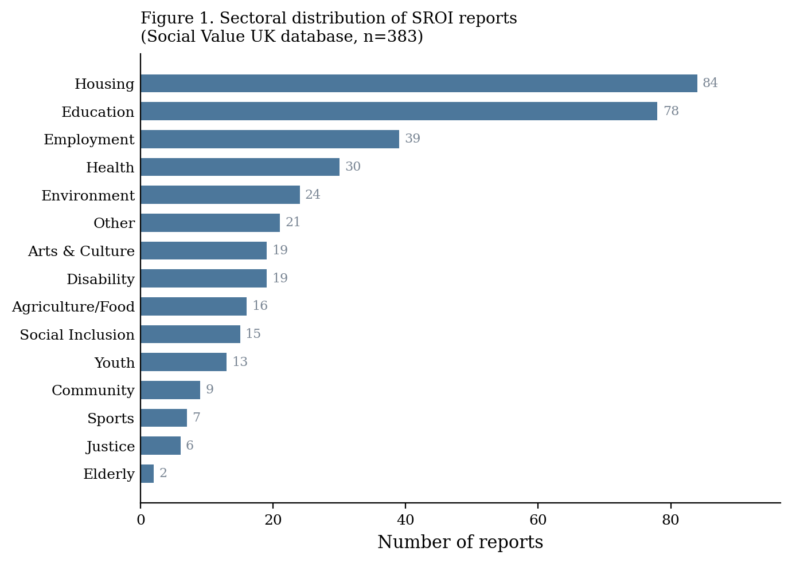
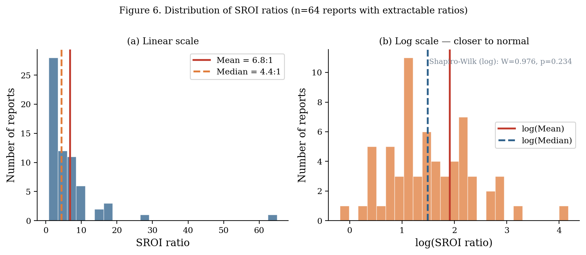

This section documents the empirical landscape of SROI practice in the Social Value UK database: where reports come from, which sectors they cover, what types of organisations produce them, and how SROI ratios are distributed.

## Corpus Overview

The analysis draws on 383 SROI reports scraped from the Social Value UK reports database in March 2026. Of these, 376 (98.2%) contained extractable PDF text. The corpus spans 2004–2025, with the majority of reports concentrated after 2015.

::: {.callout-note}
**Eight reports (2.1%)** have formal SVI assurance (`is_assured = 1`). These form a quality subsample throughout the analysis.
:::

## Sectoral Distribution

Housing (22%), education (20%), and employment (10%) account for more than half of the corpus. This concentration reflects the sectors where SROI adoption has been most actively promoted — particularly through the UK government's Social Value Act (2012) and the Social Value UK network's sectoral working groups.

{fig-alt="Bar chart showing sector distribution"}

### Sector breakdown

| Sector | Reports | % |
|--------|---------|---|
| Housing | 84 | 21.9% |
| Education | 77 | 20.1% |
| Employment | 38 | 9.9% |
| Health | 31 | 8.1% |
| Community | 28 | 7.3% |
| Environment | 25 | 6.5% |
| Disability | 22 | 5.7% |
| Youth | 18 | 4.7% |
| Arts & Culture | 15 | 3.9% |
| Other/Unknown | 45 | 11.7% |

Housing and education together account for 42% of the corpus — a concentration that limits generalisability but reflects where SROI has been most systematically institutionalised.

## Geographic Distribution

The United Kingdom dominates the corpus (53%), reflecting the origin of the SVI network and the Social Value Act's requirements for public procurement. Australia (8%), the United States (7%), Ireland (6%), and Scotland (5%) follow at a considerable distance.

This geographic concentration is not unique to this corpus. Krlev et al. (2013) found similar UK dominance in academic SROI publications, and Corvo et al. (2022) confirmed persistent UK concentration in the peer-reviewed literature. The practitioner base may be even more concentrated.

**A note on the Scotland/UK distinction:** Scottish reports are coded separately because Scotland operates its own public procurement social value requirements through different legislation. In practice, Scottish methodology follows the same SVI framework as the rest of the UK.

## Report Types

| Type | N | % |
|------|---|---|
| Evaluative | 343 | 89.6% |
| Forecast | 40 | 10.4% |
| Scoping | 0 | 0.0% |

Forecast reports, which project future social value before a programme begins, account for 10.4% of the corpus. This distinction is analytically important: forecast reports must make assumptions explicit in a way that evaluative reports often do not, which — as we show in the [Calculation Elements](factors.qmd) section — generates a structural forecast premium in methodological quality.

## SROI Ratios

Of the 383 reports in the corpus, **64 (16.7%)** contain a clearly extractable SROI ratio. The remainder present social value calculations without a single summary ratio, use narrative-only presentations, or use formats that prevented automated extraction.

::: {.grid-2}

| Statistic | Value |
|-----------|-------|
| N (with ratio) | 64 |
| Mean | 7.52:1 |
| Median | 4.44:1 |
| Std. deviation | 9.18 |
| 25th percentile | 2.55:1 |
| 75th percentile | 8.73:1 |
| Minimum | 0.83:1 |
| Maximum | 65:1 |
| Skewness | 4.1 |
:::

### Ratio interpretation

The ratio distribution has three notable properties:

1. **Heavy right skew.** The mean (7.52:1) is substantially above the median (4.44:1), driven by a small number of reports with ratios above 20:1. Outlier ratios above 15:1 are almost always associated with programmes where outcomes are measured very broadly, proxies are uncorrected, or the denominator (investment) is narrowly defined.

2. **Non-trivial variance.** The interquartile range (2.55–8.73) spans more than 6 ratio units. This variance is partly substantive (different programme types generate different value) and partly artefactual (different methodological choices inflate or deflate the ratio).

3. **Floor cases.** Three reports show ratios below 1:1, meaning the measured social value returned is less than the investment. These are not methodological errors — they may reflect programmes that were genuinely ineffective, or programmes where the choice of outcome scope and proxy was conservative.

### Ratio by sector

::: {.callout-note}
The subsample of 64 reports with extractable ratios is too small for robust sector-level ratio comparisons. The [Bootstrap Confidence Intervals](simulations.qmd) section presents permutation tests showing which sector-level differences, if any, are statistically distinguishable from sampling variation.
:::

## Temporal Trends

Report volume grew substantially from 2010 to 2018, then stabilised. The 2012 Social Value Act in England and Wales — which required public bodies to consider social value in procurement — coincides with the sharpest growth period in the corpus. Post-2020 counts are lower, consistent with database submission lags (recent reports may not yet be in the database).

The ratio distribution shows no statistically significant temporal trend (permutation test p = 0.31), suggesting that methodological quality has not improved systematically over the 20-year period of the database.
