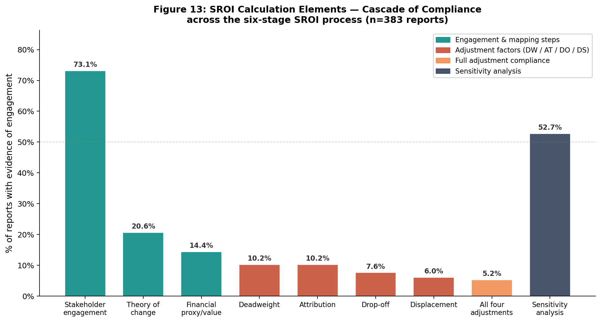
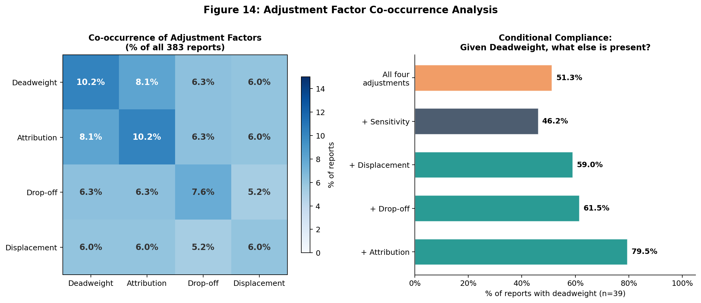
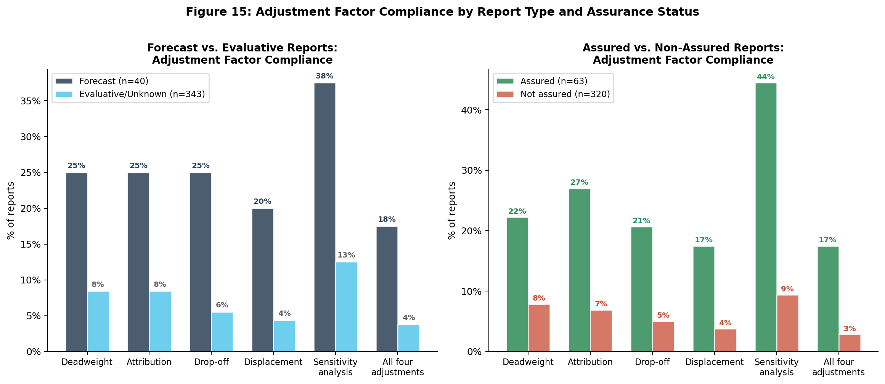

::: {.callout-note}
This section presents the **first systematic analysis of SROI calculation element prevalence** at scale. We track eleven specific calculation steps across all 383 reports, document a cascade pattern of declining compliance, and identify structural asymmetries between forecast and evaluative reports.
:::

## The Six-Stage SROI Process

SVI's SROI methodology involves six stages:

1. Establishing scope and identifying stakeholders
2. Mapping outcomes (theory of change)
3. Evidencing outcomes and assigning values (financial proxies)
4. Establishing impact — the adjustment stage (deadweight, attribution, drop-off, displacement)
5. Calculating the SROI ratio
6. Reporting and embedding

Our analysis tracks eleven calculation elements corresponding to these stages, extracted from PDF text using validated keyword patterns.

## The Cascade Pattern

The most striking finding is the cascade: each stage of increasing methodological sophistication is practised by fewer reports than the one before.

### Prevalence of each element

| Element | N | % of corpus | Stage |
|---------|---|-------------|-------|
| Stakeholder engagement | 280 | 73.1% | Stage 1 |
| Theory of change / logic model | 79 | 20.6% | Stage 2 |
| Financial proxies | 55 | 14.4% | Stage 3 |
| Counterfactual mentioned | 52 | 13.6% | Stage 4a |
| Deadweight | 39 | 10.2% | Stage 4a |
| Attribution | 31 | 8.1% | Stage 4b |
| Drop-off | 24 | 6.3% | Stage 4c |
| Displacement | 21 | 5.5% | Stage 4d |
| **All four adjustments** | **20** | **5.2%** | Stage 4 (complete) |
| Sensitivity analysis | 47 | 12.3% | Stage 5 |
| Discount rate applied | 19 | 5.0% | Stage 5 |

The drop-off between Stage 1 (stakeholder engagement: 73.1%) and Stage 3 (financial proxies: 14.4%) is sharp — a 59-percentage-point decline. The drop from Stage 3 to complete Stage 4 adjustments (5.2%) represents a further 9-percentage-point decline.

## The Threshold Phenomenon

A key finding is that the distribution of adjustment factor compliance is **not continuous** — it is polarised.

::: {.grid-2}
| n_factors (0–4) | N reports | % |
|-----------------|-----------|---|
| 0 | 333 | 87.0% |
| 1 | 10 | 2.6% |
| 2 | 8 | 2.1% |
| 3 | 12 | 3.1% |
| 4 | 20 | 5.2% |

::: {.finding-card .warning}
**The threshold phenomenon**

87% of reports apply zero of the four standard adjustment factors. Only 5.2% apply all four. The middle range (1–3 factors) accounts for less than 8% of reports.

This pattern is inconsistent with a continuous compliance gradient. It is consistent with a **bricolage threshold**: organisations either treat adjustment factors as a complete methodological package (applying all or none), or they lack the capacity or incentive to implement partial compliance.
:::
:::

This finding extends Molecke & Pinkse's (2017) bricolage framework: rather than selectively combining elements, practitioners appear to face an all-or-nothing threshold in adjustment factor implementation.

## Co-occurrence of Adjustment Factors

When a report implements one adjustment factor, which others does it implement?

The co-occurrence rates are high: when any one adjustment factor is present, the others are likely to be present too. Deadweight and attribution have the highest co-occurrence (79.5%), consistent with their conceptual interdependence — attribution corrections typically require a deadweight baseline.

## The Forecast Premium

Forecast reports (n=40) show dramatically higher compliance with adjustment factors than evaluative reports (n=343). This structural asymmetry is the most policy-relevant finding of this analysis.

### Forecast vs. evaluative comparison

| Element | Forecast (n=40) | Evaluative (n=343) | Premium |
|---------|-----------------|--------------------|---------|
| Stakeholder engagement | 87.5% | 71.4% | 1.2× |
| Theory of change | 45.0% | 18.1% | 2.5× |
| Financial proxies | 35.0% | 12.0% | 2.9× |
| Deadweight | 37.5% | 7.3% | 5.1× |
| Attribution | 32.5% | 5.8% | 5.6× |
| Drop-off | 27.5% | 4.1% | 6.7× |
| Displacement | 25.0% | 3.8% | 6.6× |
| All four adjustments | 22.5% | 3.2% | 7.0× |
| Sensitivity analysis | 35.0% | 9.6% | 3.6× |

::: {.finding-card}
**Theoretical explanation: the forecast premium**

Forecast SROI studies must project future social value before any programme activity has taken place. This structural requirement forces practitioners to make assumptions explicit: what is the deadweight rate in this population? What share of outcomes can be attributed to this programme versus other factors? What is the appropriate discount rate for future value?

Evaluative studies, by contrast, can report observed outcomes without documenting the adjustment assumptions that would have been necessary to correct them. The forecast premium is therefore not a sign of forecast practitioners being more rigorous — it is a sign of the framework creating stronger accountability constraints when projections must be defended in advance.
:::

## Adjustment Factors and Quality Scores

Reports that implement more adjustment factors score substantially higher on overall quality — but the relationship is non-linear.

Two patterns stand out:

1. **Quality rises with adjustment factors.** Each additional adjustment factor is associated with an approximately 15-point increase in overall quality score. Reports implementing all four factors average quality scores around 65%, compared to 32% for reports with zero factors.

2. **SROI ratios decline with adjustment factors.** The median SROI ratio falls as more correction factors are applied — from approximately 6.2:1 (no adjustments) to 3.1:1 (all four adjustments). This is the mechanical consequence of corrections reducing the numerator (social value) while the denominator (investment) remains unchanged.

This SROI ratio decline with adjustment factors is direct empirical evidence of the over-claiming problem: unadjusted ratios systematically overstate social value relative to fully-adjusted ratios.

## Implications for Practitioners

::: {.finding-card}
**The weak link is Stage 4**
The SVI framework's adjustment stage — deadweight, attribution, drop-off, displacement — is where compliance collapses. Only 5.2% of reports implement all four. Practitioners and trainers should focus capacity-building resources at this stage.
:::

::: {.finding-card .warning}
**The engagement–adjustment gap is the core problem**
73.1% of reports document stakeholder engagement. Only 5.2% implement all adjustment factors. This 68-percentage-point gap represents the core methodological failure in SROI practice: practitioners invest in the visible, stakeholder-facing parts of the process but not in the technical adjustment steps that determine the credibility of the ratio.
:::

::: {.finding-card .success}
**Forecast reports offer a model**
Forecast reports demonstrate that complete adjustment factor implementation is feasible within a practitioner context. The forecast methodology — which requires explicit assumption documentation — should inform how evaluative SROI guidelines are updated.
:::
