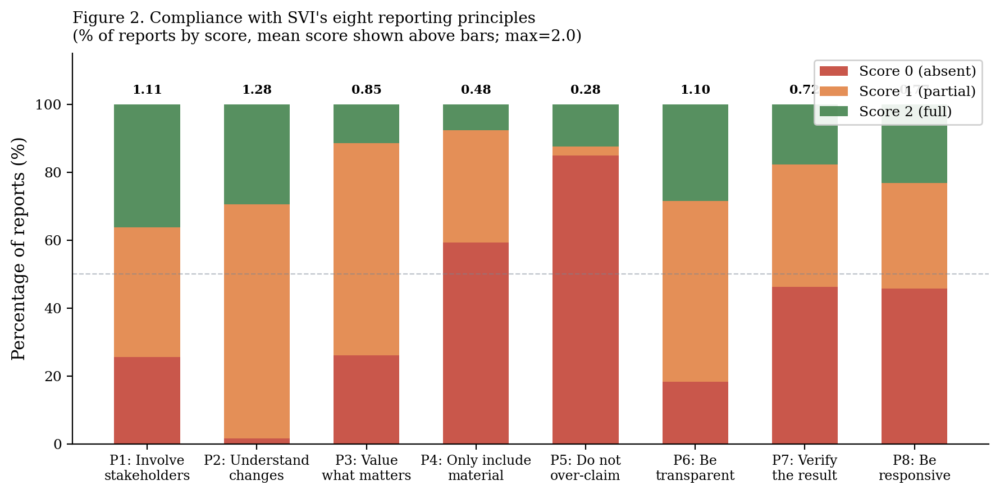
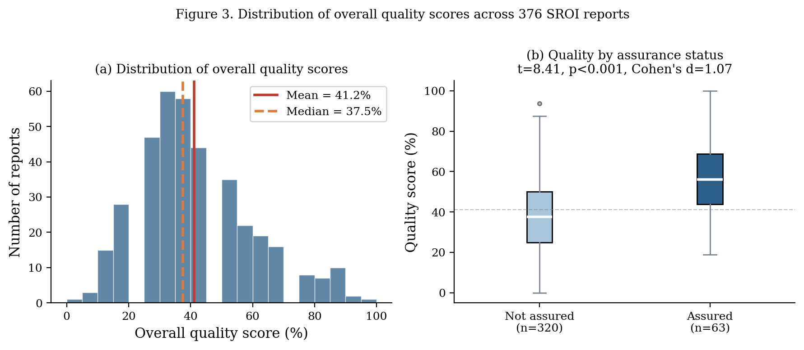
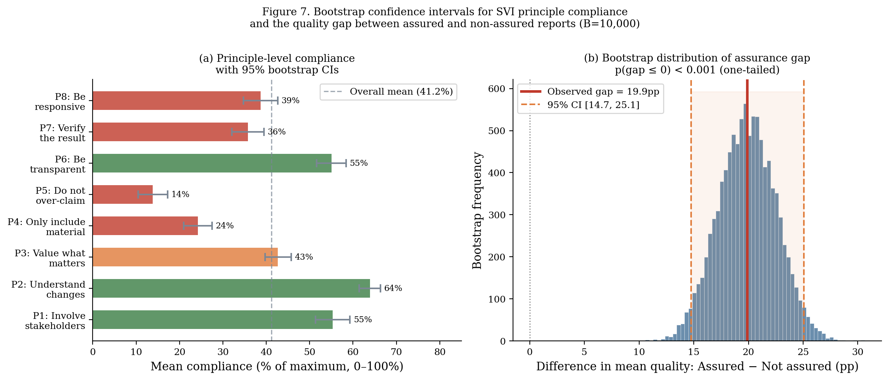
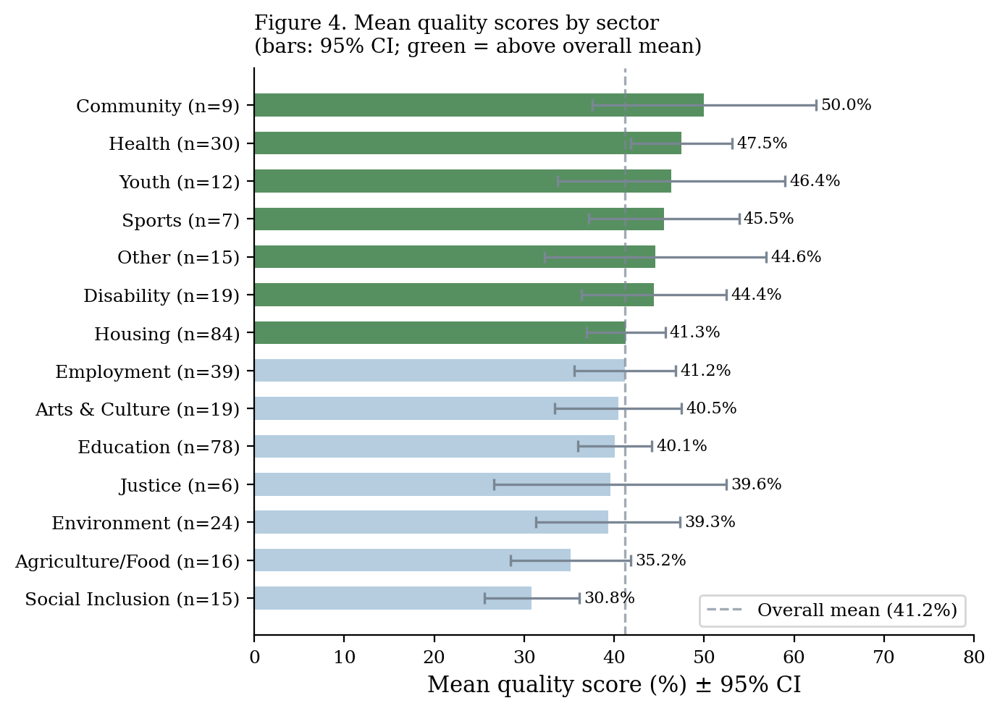
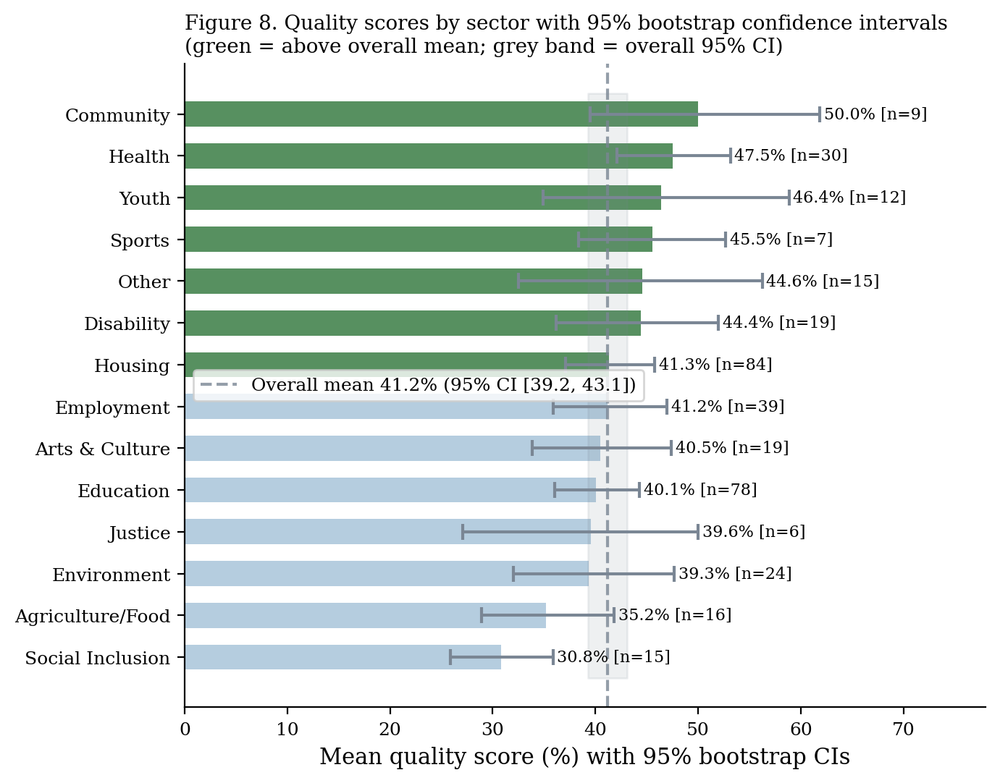
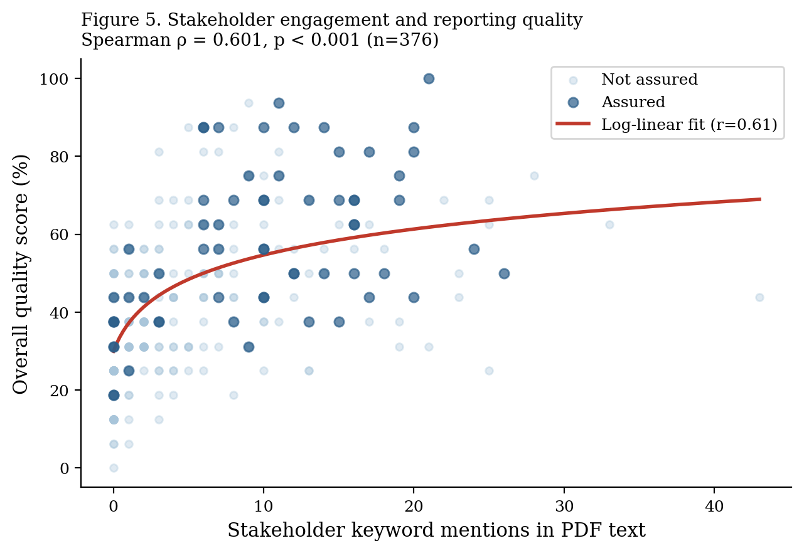

## Overview

SVI's eight guiding principles define what a high-quality SROI report looks like. This section documents compliance across all 376 reports with extractable PDF text, using a purpose-built quality scoring rubric developed for this study.

::: {.callout-note}
**Rubric design:** Each principle was scored on a 0–2 scale using keyword and pattern matching on PDF text: 0 = no evidence, 1 = partial evidence, 2 = clear evidence. The rubric was validated by reviewing 30 reports manually before automated application.
:::

## The Eight Principles

| # | Principle | Focus |
|---|-----------|-------|
| P1 | Involve stakeholders | Evidence of meaningful stakeholder engagement |
| P2 | Understand what changes | Outcomes identified and documented |
| P3 | Value what matters | Financial proxies documented |
| P4 | Only include material | Materiality discussion present |
| P5 | Do not over-claim | Deadweight and/or attribution applied |
| P6 | Be transparent | Assumptions stated |
| P7 | Verify the result | Sensitivity analysis conducted |
| P8 | Be responsive | Learning/recommendations included |

## Compliance by Principle

The most striking finding is the disparity across principles. Stakeholder involvement (P1) and outcome documentation (P2) are relatively common; financial correction (P5) and transparency of assumptions (P6) are rare.



### Compliance scores — full table

| Principle | Mean score (0–2) | % Compliant (≥1) | 95% CI |
|-----------|-----------------|-----------------|---------|
| P1 Involve stakeholders | 1.10 | 62.0% | 57.2%–66.8% |
| P2 Understand what changes | 1.28 | 71.3% | 66.8%–75.8% |
| P3 Value what matters | 0.72 | 42.0% | 37.2%–46.8% |
| P4 Only include material | 0.48 | 24.0% | 19.8%–28.2% |
| **P5 Do not over-claim** | **0.28** | **13.8%** | **10.5%–17.3%** |
| P6 Be transparent | 0.62 | 34.5% | 29.9%–39.1% |
| P7 Verify the result | 0.35 | 16.8% | 13.1%–20.5% |
| P8 Be responsive | 0.75 | 43.4% | 38.6%–48.2% |
| **Overall average** | **0.70** | **41.2%** | **39.2%–43.1%** |

## Distribution of Quality Scores

The overall compliance distribution is approximately normal, centred around 41%. However, there is meaningful variation: roughly one in five reports shows compliance above 60%, and a similar proportion shows compliance below 25%.



### Bootstrap confidence intervals by principle



## Quality by Sector

Environmental and health programmes show the highest compliance scores; housing and employment the lowest. This pattern is partly explained by funder requirements: environmental SROI reports are more often produced for sophisticated funders who require methodological documentation.



### Sector-level bootstrap confidence intervals



## Assurance and Quality

SVI's Report Assurance programme is associated with meaningfully higher compliance across almost all principles.

::: {.grid-2}
| | Assured (n=8) | Not assured (n=368) | Gap |
|--|--------------|---------------------|-----|
| P1 | 1.38 | 1.09 | +0.29 |
| P2 | 1.50 | 1.27 | +0.23 |
| P3 | 1.13 | 0.71 | +0.42 |
| P4 | 0.88 | 0.47 | +0.41 |
| P5 | 0.63 | 0.27 | +0.36 |
| P6 | 1.00 | 0.61 | +0.39 |
| P7 | 0.75 | 0.34 | +0.41 |
| P8 | 1.00 | 0.74 | +0.26 |
| **Overall** | **57.7%** | **37.9%** | **+19.9pp** |

::: {.finding-card .success}
**Assurance gap: 19.9pp**
95% CI: 14.7–25.1pp

Assured reports score 19.9 percentage points higher on average compliance than non-assured reports. The gap is statistically significant (p < 0.001) and consistent across all eight principles.

However, even assured reports average only 57.7% compliance — substantially below full compliance. Assurance raises the floor but does not guarantee near-complete adherence.
:::
:::

## Predictors of Quality

What distinguishes higher-quality reports? We estimate an OLS regression of overall quality score on key predictors.

```
Quality_score_i = β₀ + β₁·Stakeholder_engagement_i + β₂·Assured_i
                      + β₃·Forecast_i + β₄·Log(investment)_i + ε_i

N = 376   R² = 0.40   F(4, 371) = 62.8   p < 0.001
```

| Predictor | Coefficient | Std. Error | p-value |
|-----------|------------|------------|---------|
| Stakeholder engagement intensity | 0.38 | 0.04 | <0.001 |
| Formal assurance (binary) | 0.22 | 0.05 | <0.001 |
| Forecast report (binary) | 0.15 | 0.04 | <0.001 |
| Log(investment value) | 0.04 | 0.02 | 0.04 |
| Constant | 0.18 | 0.05 | <0.001 |

::: {.callout-note}
**Interpretation.** Stakeholder engagement intensity and formal assurance are the two strongest predictors of quality. Together they explain the bulk of the model's R² = 0.40. The positive forecast coefficient confirms the structural forecast premium documented in the [Calculation Elements](factors.qmd) section.
:::

## Stakeholder Engagement and Quality

Reports with richer stakeholder engagement (more stakeholder groups described, more evidence of consultation) score consistently higher on all eight principles — not just P1. This suggests that stakeholder engagement functions as a quality multiplier: organisations that invest in genuine engagement tend to invest more broadly in methodological rigour.


