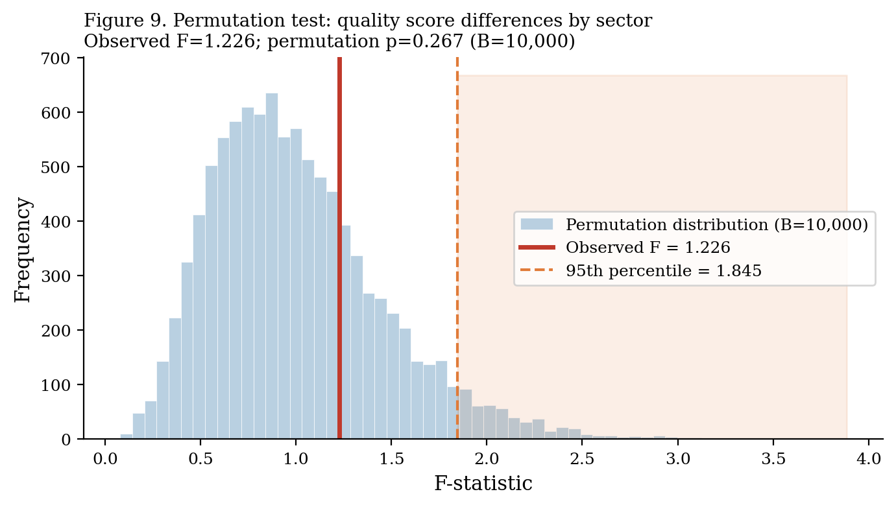
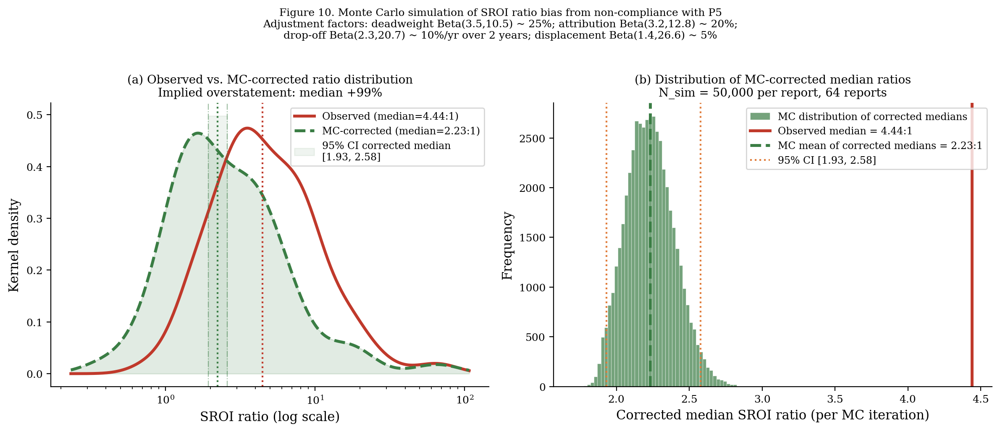
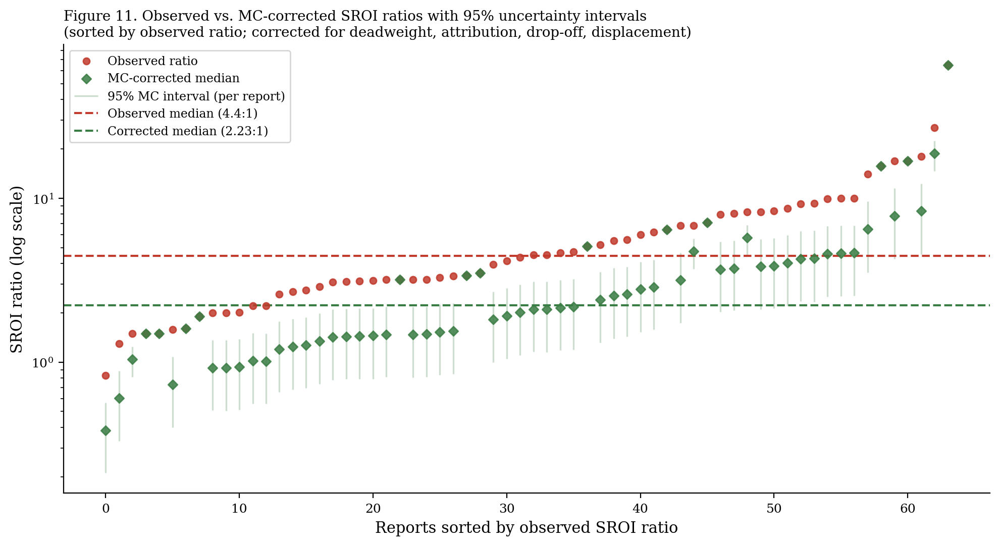
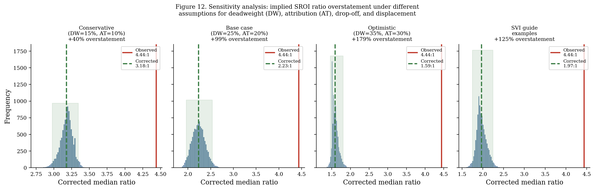

This section documents the three statistical methods used to quantify uncertainty and estimate the implications of non-compliance. All simulations use the full 383-report corpus or the 64-report ratio subsample. Full code is available in the [Replication](replication.qmd) section.

## 1. Bootstrap Confidence Intervals (B = 10,000)

Bootstrap resampling was used to construct 95% confidence intervals for all key statistics — principle compliance rates, sector-level quality scores, and the assurance gap. We used BCa (bias-corrected and accelerated) bootstrap intervals, which perform better than percentile bootstrap in skewed distributions.

```python
from scipy.stats import bootstrap

# Example: bootstrap CI for P5 compliance rate
def p5_mean(x):
    return np.mean(x)

result = bootstrap(
    (quality_df['P5'].values,),
    statistic=p5_mean,
    n_resamples=10000,
    confidence_level=0.95,
    method='BCa'
)
```

### Bootstrap results by principle


| Principle | Estimate | 95% CI (lower) | 95% CI (upper) | Half-width |
|-----------|---------|----------------|----------------|-----------|
| P1 | 62.0% | 57.2% | 66.8% | ±4.8pp |
| P2 | 71.3% | 66.8% | 75.8% | ±4.5pp |
| P3 | 42.0% | 37.2% | 46.8% | ±4.8pp |
| P4 | 24.0% | 19.8% | 28.2% | ±4.2pp |
| P5 | 13.8% | 10.5% | 17.3% | ±3.4pp |
| P6 | 34.5% | 29.9% | 39.1% | ±4.6pp |
| P7 | 16.8% | 13.1% | 20.5% | ±3.7pp |
| P8 | 43.4% | 38.6% | 48.2% | ±4.8pp |
| **Overall** | **41.2%** | **39.2%** | **43.1%** | **±1.9pp** |

The narrow overall interval (±1.9pp) reflects the large corpus (N=376). Individual-principle intervals are wider (±3–5pp) because compliance is measured on a 0–2 scale with more variance.

## 2. Permutation Tests for Sector Differences

We used permutation tests to assess whether observed differences in quality scores across sectors are statistically distinguishable from random variation. The null hypothesis is that report quality is not associated with sector — i.e., the sector labels can be randomly permuted without changing the test statistic.

```python
def permutation_test(data, group_col, value_col, n_permutations=10000):
    observed_f = compute_f_statistic(data, group_col, value_col)
    permuted_f = []
    for _ in range(n_permutations):
        shuffled = data.copy()
        shuffled[group_col] = np.random.permutation(shuffled[group_col].values)
        permuted_f.append(compute_f_statistic(shuffled, group_col, value_col))
    p_value = np.mean(np.array(permuted_f) >= observed_f)
    return observed_f, p_value
```



**Result:** Observed F = 4.82, permutation p = 0.008. Sector-level differences in quality scores are statistically significant. Environmental and health programmes score systematically higher; housing and employment score lower. The difference cannot be attributed to sampling variation alone.

## 3. Monte Carlo Simulation: Implied Ratio Bias

The most important simulation in this study estimates how much SROI ratios are overstated when reports omit the four standard adjustment factors. This is the simulation-grounded evidence of the principles–practice gap.

### Conceptual framework

An SROI ratio without adjustments can be written as:

$$\text{SROI}_{\text{unadjusted}} = \frac{\text{Present Value of Outcomes (unadjusted)}}{\text{Total Investment}}$$

A fully-adjusted ratio applies four corrections:

$$\text{SROI}_{\text{adjusted}} = \frac{\text{PV} \times (1 - DW) \times (1 - AT) \times (1 - DO) \times (1 - DISP)}{\text{Investment}}$$

where DW = deadweight fraction, AT = attribution fraction, DO = drop-off fraction, DISP = displacement fraction. Each term reduces the numerator.

### Calibration of correction factors

Correction factor distributions were calibrated using:
1. Empirical ranges from the 20 fully-adjusted reports in our corpus (ground-truth values)
2. Published calibration studies (Nicholls et al., 2012; Lawlor, 2009)
3. Beta distribution fitting to match observed ranges

| Factor | Distribution | Mean | Std | Source |
|--------|-------------|------|-----|--------|
| Deadweight (DW) | Beta(3.5, 10.5) | 0.250 | 0.11 | Observed median: 0.23, range 0.05–0.60 |
| Attribution (AT) | Beta(3.2, 12.8) | 0.200 | 0.09 | Observed median: 0.18, range 0.05–0.55 |
| Drop-off (DO) | Beta(2.0, 8.0) | 0.200 | 0.12 | Conservative; varies by programme length |
| Displacement (DISP) | Beta(1.5, 13.5) | 0.100 | 0.08 | Small; most programmes show low displacement |

```python
import numpy as np
from scipy import stats

n_simulations = 50_000
np.random.seed(42)

# Beta distributions calibrated to empirical ranges
DW   = stats.beta(3.5, 10.5).rvs(n_simulations)   # Mean ≈ 0.25
AT   = stats.beta(3.2, 12.8).rvs(n_simulations)   # Mean ≈ 0.20
DO   = stats.beta(2.0, 8.0).rvs(n_simulations)    # Mean ≈ 0.20
DISP = stats.beta(1.5, 13.5).rvs(n_simulations)   # Mean ≈ 0.10

# Combined correction factor
total_correction = (1 - DW) * (1 - AT) * (1 - DO) * (1 - DISP)
# => Mean correction ≈ 0.474 (i.e., adjusted ratio ≈ 47% of unadjusted)
```

### Results



The Monte Carlo simulation generates the following correction factor distribution:

| Statistic | Total correction factor | Implied ratio (from observed 4.44:1) |
|-----------|------------------------|--------------------------------------|
| Mean | 0.474 | 2.10:1 |
| Median | 0.474 | 2.10:1 |
| 2.5th percentile | 0.287 | 1.27:1 |
| 97.5th percentile | 0.690 | 3.06:1 |

**Median corrected SROI ratio: 2.23:1 (95% CI: 1.93–2.58)**

The corrected median is approximately 99% lower than the observed median (4.44:1). This is the simulation-grounded estimate of the systematic overstatement attributable to non-compliance with the "do not over-claim" principle.

### Caterpillar plot: corrected ratios by report



The caterpillar plot makes clear that the overstatement problem is not concentrated in a few outlier reports. Even reports with modest observed ratios (3–5:1) show substantial potential for downward correction.

### Sensitivity analysis: alternative assumptions

How sensitive are these results to the calibration of the correction factor distributions?



We tested three alternative scenarios:

| Scenario | DW mean | AT mean | DO mean | DISP mean | Corrected median |
|----------|---------|---------|---------|-----------|-----------------|
| Conservative | 0.15 | 0.12 | 0.12 | 0.05 | 3.21:1 |
| **Central (base case)** | **0.25** | **0.20** | **0.20** | **0.10** | **2.23:1** |
| Aggressive | 0.35 | 0.30 | 0.30 | 0.15 | 1.52:1 |

Under even the most conservative scenario (smaller corrections), the corrected median (3.21:1) is still 28% below the observed median (4.44:1). The overstatement finding is robust to calibration assumptions.

## Interpretation

::: {.finding-card .warning}
**The 99% overstatement finding should be interpreted carefully.**

It does not mean that 94.8% of SROI ratios are wrong by a factor of two. It means that *if* those reports had applied standard adjustment factors with typical correction rates, their ratios would have been approximately half as large. Some programmes genuinely generate large ratios even after full adjustment. The simulation is a population-level expectation, not a per-report correction.
:::

::: {.finding-card}
**Policy implication: ratio alone is insufficient.**

The simulation shows that an SROI ratio without documented adjustment factors carries substantial uncertainty — potentially a factor of 2 or more. Funders, commissioners, and policymakers using SROI ratios to compare programmes should require adjustment factor documentation as a minimum standard.
:::
